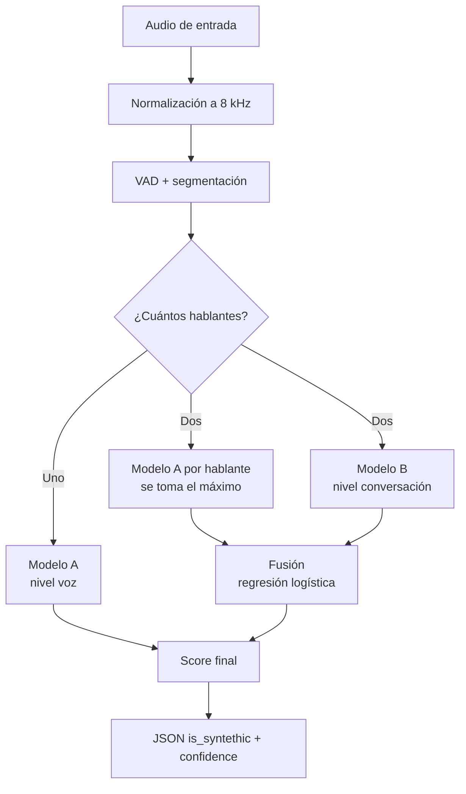

# VoiceGuard — Guía de Implementación
### Detección de agentes sintéticos en llamadas bancarias
**Reto Altur · HackMTY 2026 · 32 horas**

Equipo: Carlos Gloria · Fernando García · Aarón Hernández · Andrés Guzmán

---

## 0. Resumen del proyecto

Construimos un sistema que recibe el audio de una llamada y determina si uno de los participantes es un agente artificial, devolviendo además un nivel de confianza calibrado y una justificación auditable de la decisión.

La tesis técnica del proyecto se resume en una frase:

> Un sintetizador moderno puede clonar el timbre de una voz casi a la perfección, pero no puede reproducir ni la mecánica involuntaria del aparato fonador ni la dinámica temporal de una conversación humana.

De ahí salen los dos ejes de detección. Uno mira **la voz** (¿hay un cuerpo produciendo este sonido?) y otro mira **la conversación** (¿este intercambio tiene ritmo humano?). El sistema final los combina.

**Entregable obligatorio:** endpoint `POST /detect` que recibe un archivo de audio y responde

```json
{ "is_syntethic": true, "confidence": 0.87 }
```

---

## 1. Marco teórico del problema

### 1.1 Por qué esto no es detección de deepfake

El reto pide separar llamadas *human-to-human* de llamadas *agent-to-human*. La diferencia con la detección de deepfake clásica no es cosmética: cambia el espacio de features disponible.

Un detector de deepfake recibe un archivo aislado y solo puede examinar la señal acústica. Nosotros recibimos una **interacción**, y eso habilita una familia entera de señales de nivel superior —turnos, latencias, solapamientos— que son inaccesibles para un detector de archivo.

Esto importa porque ya existen modelos anti-spoofing preentrenados y descargables (AASIST, RawNet2, wav2vec2 afinado en ASVspoof). Cualquier equipo puede clonarlos. Ninguno mira la estructura conversacional. Ese es nuestro espacio defendible.

### 1.2 Las tres capas de evidencia

| Capa | Pregunta que responde | Fundamento |
|---|---|---|
| **Conversacional** | ¿El intercambio tiene ritmo humano? | Restricciones cognitivas y de arquitectura de sistemas |
| **Fisiológica** | ¿Hay un aparato fonador biológico? | Biomecánica de la fonación |
| **Espectral / Fourier** | ¿Hay artefactos de síntesis en la señal? | Limitaciones de los vocoders |

Las tres son complementarias porque fallan en escenarios distintos. La conversacional no aplica a un audio de un solo hablante. La fisiológica se degrada con audio muy comprimido. La espectral es vulnerable a un vocoder nuevo que no hayamos visto. Juntas, el sistema es robusto.

---

## 2. Arquitectura del sistema

El dataset tiene una característica que define el diseño: además de llamadas con dos participantes, contiene **audios donde habla una sola persona**, y viene con **anotaciones de quién habla y cuándo**.

Eso nos permite entrenar dos modelos con supervisión distinta y fusionarlos.



**Modelo A — nivel voz.** Entrenado con capas fisiológica y espectral sobre segmentos de un solo hablante. Responde: *¿esta voz es sintética?*

**Modelo B — nivel conversación.** Entrenado con la capa conversacional sobre llamadas de dos participantes. Responde: *¿este intercambio tiene ritmo de agente?*

**Fusión.** Una regresión logística de dos entradas combina ambos scores. Si solo hay un hablante, se usa Modelo A directamente.

### Por qué esta separación importa

Multiplica los datos de entrenamiento. Con 300 llamadas etiquetadas a nivel conversación, el Modelo B tiene 300 ejemplos. Pero el Modelo A se entrena sobre **segmentos de voz**, y una llamada de tres minutos aporta decenas. Con la unidad de análisis correcta, el problema de datos escasos se reduce mucho.

Además, hace el sistema robusto a la entrada. Si los jueces mandan un clip de cinco segundos con una sola voz, el endpoint sigue funcionando.

---

## 3. Implementación paso a paso

### Paso 1 — Infraestructura y entorno

**Qué se hace:** servidor Vultr operativo, repositorio con estructura definida, entorno reproducible.

**Herramientas:** Vultr (Ubuntu 24.04, 4 vCPU / 8 GB, sin GPU), Git, `venv`, ffmpeg.

```bash
sudo apt update && sudo apt install -y python3.11-venv ffmpeg git nginx
python3.11 -m venv .venv && source .venv/bin/activate
pip install -r requirements.txt
```

**Justificación:** no se pide GPU porque no vamos a entrenar redes profundas desde cero. Con el tamaño del dataset, los métodos de ensemble sobre features diseñadas superan a las redes, y una GPU solo añadiría tiempo de configuración de CUDA. Python 3.11 y no 3.12+ porque varias librerías de audio todavía arrastran incompatibilidades en la versión más nueva.

**`requirements.txt` completo:**

```
numpy==1.26.4
scipy==1.13.1
soundfile==0.12.1
librosa==0.10.2
praat-parselmouth==0.4.3
silero-vad==5.1
resemblyzer==0.1.3
scikit-learn==1.5.1
pandas==2.2.2
pyarrow==17.0.0
joblib==1.4.2
fastapi==0.112.0
uvicorn[standard]==0.30.5
python-multipart==0.0.9
pydantic==2.8.2
matplotlib==3.9.1
```

**Criterio de éxito:** `curl http://<IP>/health` responde desde fuera de la red del venue.

---

### Paso 2 — Inventario y auditoría del dataset

**Qué se hace:** antes de escribir una sola feature, caracterizar el dataset y buscar sesgos que el modelo pudiera explotar.

**Herramientas:** `soundfile`, `pandas`, `scipy.signal.welch`, `matplotlib`.

```python
import soundfile as sf, glob, pandas as pd

filas = []
for ruta in glob.glob("data/raw/**/*.wav", recursive=True):
    info = sf.info(ruta)
    filas.append({
        "ruta": ruta,
        "sample_rate": info.samplerate,
        "canales": info.channels,
        "duracion": info.duration,
        "subtipo": info.subtype,
    })
df = pd.DataFrame(filas)
print(df.groupby("sample_rate").size())
print(df.groupby(["etiqueta"])["duracion"].describe())
```

**La auditoría crítica — espectro promedio por clase:**

```python
from scipy.signal import welch
import numpy as np

def psd_promedio(rutas, fs=8000):
    acum = None
    for r in rutas:
        y, sr = sf.read(r)
        f, P = welch(y, fs=sr, nperseg=1024)
        acum = P if acum is None else acum + P
    return f, 10*np.log10(acum/len(rutas) + 1e-12)
```

Se grafica la densidad espectral de potencia promediada de cada clase sobre los mismos ejes.

**Justificación teórica:** este es el paso que más proyectos hunde. Si las llamadas humanas provienen de telefonía real (banda 300–3400 Hz, códec con pérdida) y las sintéticas de un TTS a 24 kHz sin comprimir, existe un **atajo discriminante trivial**: la energía por encima de 4 kHz. Un clasificador entrenado así alcanza 99% de exactitud detectando el ancho de banda, no la síntesis, y colapsa ante audio de prueba homogéneo.

Formalmente, el modelo aprende una variable de confusión correlacionada con la etiqueta en el conjunto de entrenamiento pero no causalmente ligada al fenómeno. Es el mismo error que el clasificador famoso que distinguía lobos de perros detectando nieve en el fondo.

El teorema de muestreo de Nyquist-Shannon explica por qué se ve tan claro: una señal muestreada a 8 kHz no puede contener información por encima de 4 kHz, y ese corte queda como una huella nítida en el espectro.

**Criterio de éxito:** las dos curvas de PSD deben ser visualmente indistinguibles en forma general. Si difieren, se corrige en el Paso 3 antes de continuar.

**Responsable:** Fernando, hora 1–3.

---

### Paso 3 — Normalización del audio

**Qué se hace:** llevar todo el corpus a un formato único: 8 kHz, mono, PCM 16 bits, loudness igualado.

**Herramientas:** ffmpeg, `scipy.signal.resample_poly`.

```bash
ffmpeg -y -i entrada.wav -ac 1 -ar 8000 -sample_fmt s16 \
       -af "loudnorm=I=-23:TP=-2:LRA=7" salida.wav
```

Si la clase sintética viene sin comprimir, se le aplica además el paso por códec telefónico:

```bash
ffmpeg -i limpio.wav -ar 8000 -ac 1 -c:a pcm_mulaw temp.wav
ffmpeg -i temp.wav -ar 8000 -ac 1 -sample_fmt s16 final.wav
```

**Justificación teórica, tres decisiones:**

*Por qué 8 kHz y no 16.* Se toma siempre el mínimo común denominador. Sobremuestrear no añade información —el contenido por encima de 4 kHz simplemente no existe en la grabación original— pero sí introduce artefactos de interpolación que son detectables y sistemáticos por clase. Bajar, en cambio, solo descarta información, y la descarta por igual para ambas clases.

*Por qué μ-law.* Es el códec de compansión estándar en telefonía en América. Aplica cuantización logarítmica, que preserva la relación señal-ruido relativa en señales de bajo nivel a costa de introducir ruido de cuantización no lineal. Si solo una clase lo atraviesa, ese ruido se vuelve el atajo. Si ambas lo atraviesan, se cancela como variable discriminante.

*Por qué la normalización de loudness no contamina las features fisiológicas.* El jitter y el shimmer son medidas **relativas y adimensionales**: el shimmer local es el cociente entre la diferencia media de amplitudes consecutivas y la amplitud media. Multiplicar toda la señal por una constante deja ese cociente invariante. La normalización de ganancia es, por tanto, segura para esta familia de features, mientras elimina un sesgo trivial (que una clase esté sistemáticamente más fuerte).

**Criterio de éxito:** repetir el Paso 2 sobre `data/normalized/` y confirmar que las curvas de PSD convergen.

---

### Paso 4 — VAD y calibración contra las anotaciones

**Qué se hace:** segmentar el audio en tramos de voz y silencio, y **calibrar el detector contra las anotaciones reales del dataset**.

**Herramientas:** `silero-vad`.

```python
from silero_vad import load_silero_vad, read_audio, get_speech_timestamps

modelo_vad = load_silero_vad()

def segmentar(ruta, min_sil=300, umbral=0.5):
    wav = read_audio(ruta, sampling_rate=8000)
    return get_speech_timestamps(
        wav, modelo_vad,
        sampling_rate=8000,
        min_silence_duration_ms=min_sil,
        threshold=umbral,
        return_seconds=True,
    )
```

**Calibración con las anotaciones:**

```python
def der(pred, real, dur_total, paso=0.01):
    """Detection Error Rate: fracción de tiempo mal etiquetado."""
    import numpy as np
    n = int(dur_total / paso)
    mp = np.zeros(n, bool); mr = np.zeros(n, bool)
    for s in pred: mp[int(s["start"]/paso):int(s["end"]/paso)] = True
    for s in real: mr[int(s["start"]/paso):int(s["end"]/paso)] = True
    return (mp != mr).mean()

mejor = min(
    ((ms, th, evaluar_der(ms, th)) for ms in [200,300,400,500,700]
                                    for th in [0.3,0.4,0.5,0.6]),
    key=lambda x: x[2]
)
```

**Justificación teórica:** el VAD no es una feature, es la **base de referencia temporal** sobre la que se construye toda la capa conversacional. La latencia de turno se define como el intervalo entre el fin de un tramo de voz de un hablante y el inicio del siguiente tramo del otro. Si esos límites tienen error aleatorio de ±200 ms, la varianza medida de la latencia queda dominada por el error del detector y no por el fenómeno que queremos capturar. La feature `latencia_cv` —nuestra apuesta principal— se convierte en ruido.

El parámetro `min_silence_duration_ms` tiene un compromiso claro. Demasiado corto, y las pausas de planificación dentro de una misma frase se interpretan como fin de turno, inflando artificialmente el número de turnos. Demasiado largo, y las respuestas rápidas se fusionan con el turno anterior, eliminando precisamente las latencias cortas que caracterizan al humano.

Las anotaciones del dataset convierten esta elección de adivinanza en optimización. El DER es la métrica estándar en diarización y mide la fracción de tiempo con etiqueta incorrecta.

**Advertencia de diseño — la más importante del documento:** las anotaciones se usan **solo para calibrar**, nunca como entrada al modelo. En producción el endpoint recibe un .wav desnudo. Si entrenamos con límites de turno perfectos y en producción usamos límites estimados, existe un desajuste de distribución entre entrenamiento y prueba que degrada el modelo de forma silenciosa. El pipeline de entrenamiento debe invocar exactamente las mismas funciones que la API.

**Criterio de éxito:** DER por debajo de 10%. Verificación visual sobre tres llamadas: graficar la forma de onda con los tramos detectados y los anotados superpuestos.

---

### Paso 5 — Atribución de hablante

**Qué se hace:** asignar cada tramo de voz a uno de los participantes.

**Herramientas:** `resemblyzer`, `sklearn.cluster.AgglomerativeClustering`.

```python
from resemblyzer import VoiceEncoder
from sklearn.cluster import AgglomerativeClustering

enc = VoiceEncoder()

def atribuir(wav, segmentos, fs=8000):
    embs = [enc.embed_utterance(wav[int(s["start"]*fs):int(s["end"]*fs)])
            for s in segmentos]
    etiquetas = AgglomerativeClustering(n_clusters=2).fit_predict(embs)
    return etiquetas
```

**Justificación teórica:** un embedding de locutor —también llamado d-vector o x-vector— es una proyección de un tramo de voz a un espacio vectorial de dimensión fija, entrenada de modo que tramos del mismo hablante queden cercanos bajo distancia coseno, independientemente de qué palabras se pronuncien. Es el mismo principio de los embeddings faciales.

El agrupamiento aglomerativo con número de clusters fijo en dos es apropiado porque el dominio garantiza exactamente dos participantes en una llamada bancaria. Esto elimina el subproblema más difícil de la diarización, que es estimar cuántos hablantes hay.

**Atajo posible:** si el dataset viene en estéreo con un participante por canal, este paso desaparece por completo. Verificarlo en el Paso 2 es lo primero que debe hacerse.

**Criterio de éxito:** comparar la atribución contra las anotaciones. Exactitud por encima de 90% sobre tiempo de voz.

---

### Paso 6A — Features conversacionales

**Qué se hace:** convertir el mapa de turnos en números.

**Herramientas:** `numpy` puro sobre la salida de los pasos 4 y 5.

| Feature | Definición operativa |
|---|---|
| `latencia_media` | Media del intervalo entre fin de turno y respuesta del otro |
| `latencia_std` | Desviación estándar de esos intervalos |
| `latencia_cv` | `latencia_std / latencia_media` |
| `latencia_p10` | Percentil 10 de las latencias |
| `ratio_solapamiento` | Fracción del tiempo total con ambos hablando |
| `interrupciones_min` | Turnos que inician antes del fin del anterior, por minuto |
| `tasa_backchannel` | Turnos de duración inferior a 0.6 s, por minuto |
| `duracion_turno_cv` | Coeficiente de variación de la duración de turnos |
| `ratio_silencio` | Fracción del audio sin voz |

**Justificación teórica.** Aquí hay dos argumentos independientes que convergen.

*Desde la lingüística.* El estudio transcultural de Stivers y colaboradores (PNAS, 2009) examinó la toma de turnos en diez lenguas no relacionadas y encontró que el intervalo modal entre turnos ronda los 200 milisegundos, con una fracción sustancial de respuestas que se anticipan al fin del turno anterior, produciendo solapamiento. Esto solo es posible porque el oyente **predice** el final del enunciado en vez de esperar a detectarlo. Es una universal conversacional: aparece en todas las lenguas estudiadas.

*Desde la arquitectura de sistemas.* Un agente conversacional encadena detección de fin de turno, transcripción, inferencia del modelo de lenguaje y síntesis de voz. Cada etapa impone una latencia mínima. El resultado es un piso de respuesta que difícilmente baja de 400–500 ms y, más revelador aún, una **varianza baja**, porque el mismo pipeline se ejecuta cada vez.

De ahí que `latencia_cv` sea la feature más prometedora del conjunto: no mide velocidad sino consistencia. Un humano cuyas respuestas van de 0 a 2 segundos según la complejidad de la pregunta tiene coeficiente de variación alto. Un sistema determinista lo tiene bajo. Y `latencia_p10` captura el piso arquitectónico: un agente casi nunca produce una respuesta instantánea porque no puede.

El solapamiento y los backchannels refuerzan lo mismo desde otro ángulo. Los marcadores de escucha activa —"ajá", "mhm", "sí"— se producen *mientras el otro habla*, requieren procesamiento incremental del enunciado en curso, y los agentes comerciales rara vez los generan porque su arquitectura es estrictamente por turnos.

**Responsable:** Fernando.

---

### Paso 6B — Features fisiológicas

**Qué se hace:** medir las huellas involuntarias del aparato fonador, por hablante.

**Herramientas:** `praat-parselmouth`, `scipy.signal`, `numpy.fft`.

```python
import parselmouth
from parselmouth.praat import call

def features_fisiologicas(ruta_segmento):
    snd = parselmouth.Sound(ruta_segmento)
    pp = call(snd, "To PointProcess (periodic, cc)", 60, 400)
    return {
        "jitter_local":  call(pp, "Get jitter (local)", 0,0, 1e-4, 0.02, 1.3),
        "jitter_rap":    call(pp, "Get jitter (rap)",   0,0, 1e-4, 0.02, 1.3),
        "shimmer_local": call([snd, pp], "Get shimmer (local)",
                              0,0, 1e-4, 0.02, 1.3, 1.6),
        "hnr": call(snd.to_harmonicity_cc(), "Get mean", 0, 0),
    }
```

**Temblor fisiológico vía FFT del contorno de F0:**

```python
import numpy as np

def temblor_f0(snd, fs_f0=100):
    pitch = snd.to_pitch(time_step=1/fs_f0)
    f0 = pitch.selected_array["frequency"]
    f0 = f0[f0 > 0]
    if len(f0) < 64: return np.nan
    f0 = f0 - f0.mean()
    ESP = np.abs(np.fft.rfft(f0))
    frec = np.fft.rfftfreq(len(f0), d=1/fs_f0)
    banda = (frec >= 4) & (frec <= 12)
    return ESP[banda].sum() / (ESP.sum() + 1e-12)
```

| Feature | Qué mide |
|---|---|
| `jitter_local`, `jitter_rap` | Perturbación del periodo fundamental ciclo a ciclo |
| `shimmer_local` | Perturbación de la amplitud ciclo a ciclo |
| `hnr` | Relación entre energía armónica y energía de ruido |
| `f0_std`, `f0_rango` | Dispersión de la entonación |
| `delta_f0_std` | Desviación de la primera diferencia del contorno de F0 |
| `temblor_4_12hz` | Fracción de energía del contorno de F0 en la banda del temblor |
| `respiraciones_min` | Eventos de inhalación detectados por minuto |

**Justificación teórica.** La fonación humana es un fenómeno biomecánico, no un oscilador ideal. Las cuerdas vocales son tejido con propiedades viscoelásticas no lineales, y su vibración está gobernada por control neuromuscular que tiene ruido intrínseco. El resultado es que ningún ciclo glótico es idéntico al anterior.

El **jitter** cuantifica esa irregularidad en el eje del periodo y el **shimmer** en el eje de la amplitud. En voces sanas el jitter local se sitúa típicamente entre 0.5% y 1%. Un valor cercano a cero no indica una voz excelente: indica que no hay tejido vibrando.

El **HNR** captura el problema complementario. Durante la fonación normal, parte del flujo de aire atraviesa la glotis de forma turbulenta y genera ruido de aspiración de banda ancha. Un sintetizador que modela solo la parte armónica produce señales con HNR anormalmente alto —demasiado limpias para ser reales.

El **temblor de 4 a 12 Hz** merece explicación aparte porque es la feature más específica del conjunto. Los músculos laríngeos presentan temblor fisiológico involuntario en ese rango, resultado del control motor de lazo cerrado. Ese temblor modula la frecuencia fundamental. Aplicar una FFT al contorno de F0 —tratándolo como una serie temporal muestreada a 100 Hz— revela esa componente. Un TTS genera prosodia mediante interpolación de contornos suaves y no tiene ninguna razón para producir energía en esa banda.

La **respiración** es la señal más intuitiva. La fonación humana requiere ciclos respiratorios: cada 3 a 5 segundos hay una inhalación que deja una ráfaga de energía de banda ancha y baja intensidad antes del enunciado. Se detecta filtrando en banda baja y buscando picos en los tramos que el VAD marcó como no-voz:

```python
from scipy.signal import butter, sosfilt, find_peaks, hilbert

sos = butter(4, [50, 400], btype="band", fs=8000, output="sos")
env = np.abs(hilbert(sosfilt(sos, y_silencios)))
picos, _ = find_peaks(env, distance=int(0.5*8000), prominence=np.std(env))
```

**Limitación honesta que hay que documentar:** a 8 kHz, un periodo de una voz de 100 Hz ocupa 80 muestras, y un jitter del 1% equivale a menos de una muestra. Praat obtiene precisión sub-muestral mediante correlación cruzada con interpolación parabólica, de modo que la medición sigue siendo utilizable, pero es más ruidosa que a 16 kHz. La alternativa —medir a la tasa nativa de cada archivo— está descartada porque reintroduciría el sesgo del Paso 2. Se asume la degradación y se compensa promediando sobre múltiples segmentos del mismo hablante.

**Responsable:** Andrés.

---

### Paso 6C — Features espectrales y de Fourier

**Qué se hace:** extraer artefactos de síntesis de la señal mediante análisis en el dominio de la frecuencia.

**Herramientas:** `scipy.signal.stft`, `scipy.fft`, `librosa`.

#### LFCC en lugar de MFCC

```python
from scipy.signal import stft
from scipy.fftpack import dct
import numpy as np

def lfcc(y, fs=8000, n_filtros=20, n_coef=20):
    f, t, Z = stft(y, fs=fs, nperseg=256, noverlap=176)
    pot = np.abs(Z)**2
    bordes = np.linspace(0, fs/2, n_filtros + 2)
    banco = np.zeros((n_filtros, len(f)))
    for i in range(n_filtros):
        izq, cen, der = bordes[i], bordes[i+1], bordes[i+2]
        banco[i] = np.clip(np.minimum((f-izq)/(cen-izq), (der-f)/(der-cen)), 0, None)
    log_e = np.log(banco @ pot + 1e-10)
    return dct(log_e, type=2, axis=0, norm="ortho")[:n_coef]
```

**Justificación teórica.** La escala mel es una función de compresión perceptual: fue construida a partir de experimentos psicoacústicos sobre cómo los humanos juzgan distancias de altura tonal, y comprime logarítmicamente por encima de aproximadamente 1 kHz. Los MFCC heredan esa compresión, lo cual es ideal para reconocimiento de habla —donde queremos representar lo que el oído percibe— pero contraproducente aquí.

El razonamiento es directo: los artefactos de vocoder se concentran desproporcionadamente en las frecuencias altas, y la escala mel asigna precisamente ahí la menor resolución. Estamos descartando la evidencia. Un banco de filtros lineal mantiene resolución uniforme en todo el rango, y la literatura de ASVspoof reporta consistentemente que los LFCC superan a los MFCC en la tarea de detección de suplantación.

La **DCT** final cumple dos funciones. Primero, decorrela las log-energías del banco de filtros, que están fuertemente correlacionadas entre filtros vecinos —importante para clasificadores que asumen independencia. Segundo, realiza separación fuente-filtro: al tomar logaritmo del espectro, la convolución entre la excitación glótica y la respuesta del tracto vocal se convierte en suma, y la DCT separa la componente de variación lenta (el tracto vocal, en los coeficientes bajos) de la de variación rápida (la fuente glótica, en los altos).

#### Espectro de modulación

```python
def espectro_modulacion(y, fs=8000):
    f, t, Z = stft(y, fs=fs, nperseg=256, noverlap=192)
    env = np.abs(Z)
    env = env - env.mean(axis=1, keepdims=True)
    MOD = np.abs(np.fft.rfft(env, axis=1)).mean(axis=0)
    fmod = np.fft.rfftfreq(env.shape[1], d=(t[1]-t[0]))
    e_baja = MOD[(fmod>=2)&(fmod<=8)].sum()
    e_alta = MOD[(fmod>8)&(fmod<=20)].sum()
    return {"mod_2_8": e_baja, "mod_8_20": e_alta,
            "mod_ratio": e_baja/(e_alta+1e-12),
            "mod_pico": fmod[np.argmax(MOD)]}
```

**Justificación teórica.** El espectro de modulación aplica una segunda transformada de Fourier sobre la evolución temporal de la energía en cada banda. Captura el **ritmo** de la señal, no su contenido espectral instantáneo.

El habla humana presenta un máximo pronunciado alrededor de 4–5 Hz. Esa cifra no es arbitraria: corresponde a la tasa silábica, que está acotada por la inercia mecánica de los articuladores —mandíbula, lengua, labios son masas físicas que no pueden acelerarse indefinidamente. Es una restricción biomecánica del mismo tipo que las del Paso 6B, pero medible a nivel de envolvente en lugar de a nivel de ciclo glótico.

Los sistemas de síntesis producen perfiles de modulación distintos: a menudo más dispersos, o con concentración en frecuencias que no corresponden a ninguna restricción articulatoria real.

#### Group delay — información de fase

```python
def group_delay_stats(y, fs=8000):
    f, t, Z = stft(y, fs=fs, nperseg=256, noverlap=192)
    fase = np.unwrap(np.angle(Z), axis=0)
    gd = -np.diff(fase, axis=0)
    return {"gd_std": np.std(gd), "gd_var_banda": np.var(gd, axis=1).mean()}
```

**Justificación teórica.** La STFT produce números complejos: magnitud y fase. Prácticamente todo el aparato estándar de procesamiento de habla —espectrogramas, MFCC, LFCC— descarta la fase por completo, porque el oído humano es relativamente insensible a ella.

Esa insensibilidad es precisamente lo que la hace útil como evidencia forense. Muchos sistemas de síntesis reconstruyen la forma de onda a partir de una representación de magnitud, estimando la fase mediante algoritmos iterativos como Griffin-Lim, o generándola con vocoders neuronales que no la modelan con la misma fidelidad que la magnitud. El resultado suena bien al oído pero tiene una estructura de fase que no corresponde a ningún proceso físico de producción de voz.

El **retardo de grupo** es la derivada negativa de la fase respecto a la frecuencia, y tiene interpretación física directa: cuánto se retrasa cada componente frecuencial. En voz real está determinado por la física del tracto vocal.

*Nota de implementación:* el group delay crudo es numéricamente inestable porque el desenvolvimiento de fase es sensible a ruido. La versión robusta —modified group delay— aplica suavizado cepstral antes de derivar. Por eso este bloque tiene prioridad media: alto valor argumentativo, riesgo de implementación no trivial.

#### Periodicidad de vocoder

```python
def pico_vocoder(y, fs=8000):
    env = np.abs(hilbert(y))
    ESP = np.abs(np.fft.rfft(env - env.mean()))
    frec = np.fft.rfftfreq(len(env), d=1/fs)
    banda = (frec >= 40) & (frec <= 200)
    return ESP[banda].max() / (ESP[banda].mean() + 1e-12)
```

**Justificación teórica.** Los vocoders neuronales generan la señal por bloques, típicamente con salto de 10 a 12.5 ms. Cualquier discontinuidad residual en las fronteras entre bloques introduce una componente periódica a la frecuencia de bloque (80–100 Hz). Un canal de audio real no tiene ninguna razón estructural para exhibir un pico estrecho en esa banda de la envolvente. Es una feature de bajo costo y alta especificidad: si aparece, es prácticamente concluyente.

#### Advertencia sobre dimensionalidad

**No se introducen bins crudos de FFT al modelo.** Un espectrograma de 129 bins por 200 ventanas son más de 25,000 valores por archivo. Con un dataset de este tamaño, eso garantiza sobreajuste: el modelo memoriza el ruido de fondo de cada grabación en lugar de aprender el fenómeno.

Fourier es el paso intermedio, no la feature. Todo lo que sale de una transformada debe colapsarse a un puñado de estadísticos —medias, desviaciones, energías por banda, cocientes— antes de entrar al vector. **Presupuesto total: 35 a 45 features.**

**Responsable:** Carlos.

---

### Paso 7 — Aumentación de datos

**Qué se hace:** ampliar el corpus con voz sintética generada por nosotros y con perturbaciones de canal.

**Herramientas:** ElevenLabs (API), ffmpeg, `numpy`.

```python
# Perturbaciones de canal aplicadas a AMBAS clases
def aumentar(y, fs=8000):
    variantes = []
    variantes.append(y + np.random.normal(0, 0.002, len(y)))   # ruido blanco
    variantes.append(y * np.random.uniform(0.7, 1.3))          # ganancia
    variantes.append(librosa.effects.time_stretch(y, rate=np.random.uniform(0.95,1.05)))
    return variantes
```

**Justificación teórica.** Con 300 muestras a nivel conversación, la relación entre número de ejemplos y número de parámetros efectivos es desfavorable. La aumentación actúa como regularizador: al presentar el mismo contenido bajo múltiples condiciones de canal, se fuerza al modelo a aprender representaciones invariantes a esas condiciones, que es exactamente la propiedad que necesitamos para generalizar al audio de evaluación.

**Restricción crítica:** toda voz generada con ElevenLabs debe atravesar la misma cadena de códec del Paso 3 antes de entrar al entrenamiento, y toda perturbación de canal debe aplicarse **a ambas clases por igual**. Aumentar solo la clase sintética introduciría el mismo sesgo que intentamos eliminar, solo que en dirección contraria.

**Responsable:** Aarón.

---

### Paso 8 — Modelos A y B

**Qué se hace:** entrenar los dos clasificadores base.

**Herramientas:** `scikit-learn`.

```python
from sklearn.ensemble import RandomForestClassifier
from sklearn.calibration import CalibratedClassifierCV
from sklearn.pipeline import make_pipeline
from sklearn.preprocessing import StandardScaler
from sklearn.impute import SimpleImputer

def construir():
    base = RandomForestClassifier(
        n_estimators=500, max_depth=10, min_samples_leaf=3,
        max_features="sqrt", class_weight="balanced", random_state=42)
    return make_pipeline(
        SimpleImputer(strategy="median"),
        StandardScaler(),
        CalibratedClassifierCV(base, method="isotonic", cv=5),
    )
```

**Justificación teórica, tres decisiones:**

*Por qué Random Forest y no una red neuronal.* Con features diseñadas a mano de dimensión moderada y pocos cientos de ejemplos, los métodos de ensemble basados en árboles dominan empíricamente. El bagging reduce varianza sin incrementar sesgo apreciablemente, los árboles capturan interacciones no lineales sin necesidad de especificarlas, y no hay hiperparámetros críticos que ajustar con un presupuesto de tiempo limitado. Una red profunda requeriría órdenes de magnitud más datos para superar este baseline. Además, `feature_importances_` da interpretabilidad gratuita, que es un requisito del dominio.

*Por qué calibración isotónica.* Las probabilidades que emite un Random Forest son promedios de votos de árboles, y ese promediado las sesga hacia el centro del intervalo: valores extremos se vuelven raros y la distribución se concentra alrededor de 0.5. El reto exige devolver un `confidence`, y ese número debe ser interpretable. La regresión isotónica ajusta una función monótona no paramétrica que mapea los scores crudos a probabilidades empíricamente correctas, de modo que entre los casos con confianza reportada de 0.87, aproximadamente el 87% resulten efectivamente sintéticos. Se prefiere isotónica sobre Platt (sigmoide) porque no asume forma paramétrica; con datasets muy pequeños, sin embargo, la sigmoide es más estable, así que se comparan ambas.

*Por qué `class_weight="balanced"`.* Aunque el dataset original está balanceado 150/150, la aumentación y la segmentación por hablante pueden desbalancearlo. El parámetro pondera inversamente a la frecuencia de clase y previene el sesgo hacia la mayoritaria.

---

### Paso 9 — Validación

**Qué se hace:** estimar el rendimiento real del sistema sin autoengañarse.

**Herramientas:** `sklearn.model_selection.GroupKFold`, `sklearn.metrics`.

```python
from sklearn.model_selection import GroupKFold
from sklearn.metrics import roc_auc_score, roc_curve
import numpy as np

def eer(y_true, y_score):
    fpr, tpr, _ = roc_curve(y_true, y_score)
    fnr = 1 - tpr
    i = np.nanargmin(np.abs(fnr - fpr))
    return (fpr[i] + fnr[i]) / 2

gkf = GroupKFold(n_splits=5)
for tr, te in gkf.split(X, y, groups=speaker_ids):   # agrupar por HABLANTE
    ...
```

**Justificación teórica.** La partición debe agrupar por **identidad de hablante**, no por archivo ni por llamada. Si un mismo locutor aparece en entrenamiento y en prueba, el modelo puede alcanzar exactitud alta memorizando características idiosincráticas de esa voz particular en lugar de aprender el fenómeno de la síntesis. La métrica resultante sería optimista y no predeciría nada sobre el comportamiento ante voces nuevas, que es exactamente el escenario de evaluación.

Esta es una forma de fuga de datos particularmente insidiosa porque no produce ningún síntoma visible: el modelo simplemente reporta un número excelente que resulta ser ficción.

El **EER** —punto de operación donde la tasa de falsos positivos iguala a la de falsos negativos— es la métrica estándar en la literatura de verificación de locutor y anti-suplantación. Reportarla permite comparación directa con los resultados publicados de ASVspoof y demuestra familiaridad con el campo.

Se reportan además AUC, matriz de confusión al umbral 0.5, y curva de calibración.

---

### Paso 10 — Fusión

```python
from sklearn.linear_model import LogisticRegression

# Entradas: score del Modelo A (máximo sobre hablantes) y score del Modelo B
Z = np.column_stack([score_A, score_B, n_hablantes == 2])
fusor = LogisticRegression(max_iter=1000).fit(Z, y)
```

**Justificación teórica.** La fusión a nivel de score (*late fusion*) es preferible a concatenar todas las features en un solo vector (*early fusion*) por tres razones en este contexto. Primero, los dos modelos se entrenan sobre unidades de análisis distintas —segmentos de voz versus llamadas completas— y con cantidades de datos muy diferentes; concatenar obligaría a usar la unidad más restrictiva. Segundo, permite que el sistema degrade con elegancia: si solo hay un hablante, el Modelo B no aporta y la regresión lo maneja mediante el indicador `n_hablantes`. Tercero, mantiene la interpretabilidad: los coeficientes del fusor dicen explícitamente cuánto pesa la evidencia acústica frente a la conversacional.

---

### Paso 11 — Baseline externo

**Qué se hace:** ejecutar un modelo anti-spoofing preentrenado sobre nuestro dataset.

**Herramientas:** AASIST o RawNet2 desde HuggingFace.

**Justificación teórica.** Existen detectores de voz sintética públicos y descargables. Ignorarlos es un riesgo de pitch: si un juez pregunta si los probamos y la respuesta es no, la credibilidad técnica cae.

Ejecutarlos tiene retorno en ambos escenarios posibles. Si nuestro sistema los supera, tenemos la comparación cuantitativa más persuasiva del pitch. Si no los supera, su score entra como una feature adicional al fusor y el sistema final mejora.

La hipótesis de por qué deberían degradarse en nuestro escenario es concreta y verificable: fueron entrenados sobre ASVspoof, que es inglés, audio a 16 kHz sin compresión telefónica, y con sistemas de síntesis de generaciones anteriores. Nuestro dominio difiere en idioma, canal y generación de vocoder. El desplazamiento de dominio es la explicación esperada de cualquier caída de rendimiento.

---

### Paso 12 — API

**Herramientas:** FastAPI, uvicorn, Pydantic, python-multipart.

```python
from contextlib import asynccontextmanager
from fastapi import FastAPI, UploadFile, File
from fastapi.responses import JSONResponse
import joblib, tempfile, os, logging

ESTADO = {}
log = logging.getLogger("voiceguard")

@asynccontextmanager
async def lifespan(app):
    ESTADO["bundle"] = joblib.load("models/model.joblib")
    yield

app = FastAPI(lifespan=lifespan, title="VoiceGuard")

@app.get("/health")
def health():
    return {"status": "ok", "modelo": ESTADO["bundle"]["version"]}

@app.post("/detect")
def detect(file: UploadFile = File(...)):
    tmp = None
    try:
        datos = file.file.read(25 * 1024 * 1024)
        if not datos:
            return JSONResponse({"error": "archivo vacio"}, status_code=400)
        with tempfile.NamedTemporaryFile(suffix=".bin", delete=False) as f:
            f.write(datos); tmp = f.name
        resultado = pipeline_detect(tmp, ESTADO["bundle"])
        return {"is_syntethic": bool(resultado["prob"] > 0.5),
                "confidence": round(float(resultado["prob"]), 4)}
    except AudioInvalido as e:
        return JSONResponse({"error": str(e)}, status_code=400)
    except Exception:
        log.exception("fallo en detect")
        return JSONResponse({"error": "no se pudo procesar el audio"},
                            status_code=400)
    finally:
        if tmp and os.path.exists(tmp):
            os.remove(tmp)
```

**Justificación de cada decisión:**

*FastAPI.* Validación automática vía Pydantic, soporte nativo de multipart y WebSocket, documentación OpenAPI generada sin trabajo adicional en `/docs`. Esa página es un activo de demo: un juez puede probar el endpoint desde el navegador sin herramientas externas.

*`def` y no `async def`.* El pipeline es intensivo en CPU. Una corrutina asíncrona que ejecuta trabajo bloqueante monopoliza el bucle de eventos y bloquea todas las peticiones concurrentes. Al declarar la función como síncrona, FastAPI la delega automáticamente a un pool de hilos.

*Carga del modelo en `lifespan`.* Deserializar el modelo en cada petición añadiría cientos de milisegundos. Se carga una vez al arrancar el proceso.

*Nunca devolver 500.* Los conjuntos de prueba automatizados de los patrocinadores incluyen habitualmente entradas malformadas a propósito. Un error 500 es indistinguible de un servicio caído desde el punto de vista del evaluador. Todo error se convierte en un 400 con cuerpo JSON válido.

*El typo `is_syntethic`.* Se replica exactamente como aparezca en la especificación del patrocinador. Se define como constante para poder corregirlo en segundos si resulta que el error estaba en nuestras notas. **No se envían ambas variantes de la clave:** si el validador rechaza propiedades adicionales, una clave extra invalida la respuesta completa.

**Fixtures obligatorios de prueba:** archivo vacío, PNG renombrado a .wav, mp3 truncado, wav de 0.3 s, wav de 10 minutos, audio de silencio absoluto, archivo de 100 MB.

**Responsable:** Aarón.

---

### Paso 13 — Despliegue

```ini
[Unit]
Description=VoiceGuard API
After=network.target

[Service]
User=root
WorkingDirectory=/root/voiceguard
ExecStart=/root/voiceguard/.venv/bin/uvicorn src.api:app \
          --host 0.0.0.0 --port 8000 --workers 2
Restart=always

[Install]
WantedBy=multi-user.target
```

Nginx como proxy inverso en el puerto 80.

**Justificación.** `systemd` con `Restart=always` garantiza que el servicio sobreviva a un fallo durante la demostración. Dos workers permiten atender peticiones concurrentes sin saturar las 4 vCPU. El proxy inverso elimina el puerto explícito de la URL, lo cual además evita bloqueos por cortafuegos corporativos en la red del evento.

**Regla de despliegue temprano:** la API con un modelo de prueba debe estar viva en la hora 2. El modo de fallo más común en hackatones es descubrir un problema de entorno en la hora 28.

---

### Paso 14 — Demostración

Dos elementos diferenciadores, en orden de prioridad:

**Detección progresiva vía WebSocket.** El endpoint `/detect` clasifica el archivo completo, pero el demo muestra la confianza actualizándose segundo a segundo. La justificación es de negocio: para un operador que procesa 150 millones de llamadas mensuales, la métrica relevante no es la exactitud offline sino el **tiempo hasta la decisión**. Detectar en el segundo 4 permite intervenir; detectar al final de la llamada solo permite reportar.

**Huella de voz con búsqueda vectorial.** Se almacena el embedding de locutor de cada voz marcada como sintética en MongoDB Atlas con índice vectorial. En una detección posterior, la búsqueda por similitud coseno permite responder no solo *es sintética* sino *es la misma voz sintética del caso anterior*. Esto transforma el entregable de clasificador a sistema antifraude con memoria. Prioridad baja: se implementa solo si el núcleo está terminado.

---

## 4. Tabla maestra de herramientas

| Herramienta | Paso | Función | Por qué esta |
|---|---|---|---|
| ffmpeg | 3, 7 | Decodificación, remuestreo, códec | Soporta todos los formatos; independiente de decodificadores de Python |
| soundfile | 2, 6 | Lectura/escritura de WAV | I/O rápido sin dependencias pesadas |
| scipy.signal | 3, 6B, 6C | STFT, filtros, Hilbert, Welch, picos | Implementaciones de referencia, numéricamente estables |
| numpy.fft | 6B, 6C | FFT del contorno de F0 y de envolventes | Interfaz directa para señales que no son audio |
| librosa | 6C, 7 | Utilidades de audio, time-stretch | Conveniencia; no se usa para nada crítico |
| silero-vad | 4 | Detección de actividad de voz | Robusto a ruido telefónico; nativo a 8 kHz |
| praat-parselmouth | 6B | Jitter, shimmer, HNR, F0 | Es Praat, el estándar de fonética clínica |
| resemblyzer | 5, 14 | Embeddings de locutor | Ligero, funciona en CPU |
| scikit-learn | 8, 9, 10 | Modelos, calibración, validación | Cobertura completa del ciclo de modelado |
| pandas + pyarrow | 6, 8 | Tabla de features en Parquet | Formato columnar, tipado, rápido |
| joblib | 8, 12 | Serialización del modelo | Estándar de sklearn |
| FastAPI + uvicorn | 12 | Servicio HTTP | Validación automática, docs, WebSocket |
| python-multipart | 12 | Recepción de archivos | Requisito no obvio de FastAPI |
| systemd + nginx | 13 | Servicio persistente y proxy | Reinicio automático, puerto 80 |
| ElevenLabs | 7 | Generación de voz sintética | Aumentación de la clase positiva |
| MongoDB Atlas | 14 | Búsqueda vectorial | Huella de voz persistente |

---

## 5. Matriz de riesgos

| Riesgo | Impacto | Mitigación | Paso |
|---|---|---|---|
| El modelo aprende el códec en vez de la síntesis | Crítico | Auditoría de PSD, normalización común, aumentación simétrica | 2, 3, 7 |
| Fuga de identidad de hablante entre particiones | Crítico | GroupKFold por `speaker_id` | 9 |
| Desajuste entre features de entrenamiento y de producción | Crítico | El entrenamiento invoca las mismas funciones que la API | 4 |
| Sobreajuste por exceso de dimensiones | Alto | Presupuesto de 35–45 features, nunca bins crudos | 6C |
| VAD mal calibrado degrada la capa conversacional | Alto | Optimización de DER contra anotaciones | 4 |
| Jitter degradado a 8 kHz | Medio | Promediado sobre múltiples segmentos; documentado | 6B |
| Fallo del demo en vivo | Alto | Video de respaldo grabado antes de la hora 25 | 14 |
| Ambigüedad del typo en la especificación | Medio | Confirmación directa con el mentor de Altur | 12 |

---

## 6. Checklist de entrega

- [ ] `GET /health` responde desde una red externa
- [ ] `POST /detect` devuelve el esquema exacto con la clave tal como la especifica Altur
- [ ] Ninguna entrada malformada produce un código 500
- [ ] Latencia por petición inferior a 5 segundos
- [ ] Métricas reportadas con GroupKFold por hablante: AUC, EER, matriz de confusión
- [ ] Curva de calibración incluida en el material del pitch
- [ ] Comparación contra baseline preentrenado documentada
- [ ] Video de respaldo del demo grabado
- [ ] README con instrucciones de reproducción completas
- [ ] Repositorio público y enviado en Devpost

---

## 7. Los tres argumentos del pitch

1. **No detectamos audio falso, detectamos agentes en conversación.** Los detectores existentes analizan un archivo aislado; nosotros analizamos una interacción. Un sintetizador puede clonar un timbre, pero no puede fingir que duda antes de responder.

2. **Detectamos temprano.** Con 150 millones de llamadas mensuales, lo que importa no es la exactitud al final sino el segundo en que se puede intervenir.

3. **Podemos justificar la decisión.** Latencia de respuesta anormalmente uniforme, ausencia de solapamiento conversacional, jitter vocal por debajo del rango fisiológico. Un banco no puede bloquear una cuenta porque un modelo dijo que sí; necesita evidencia auditable.
