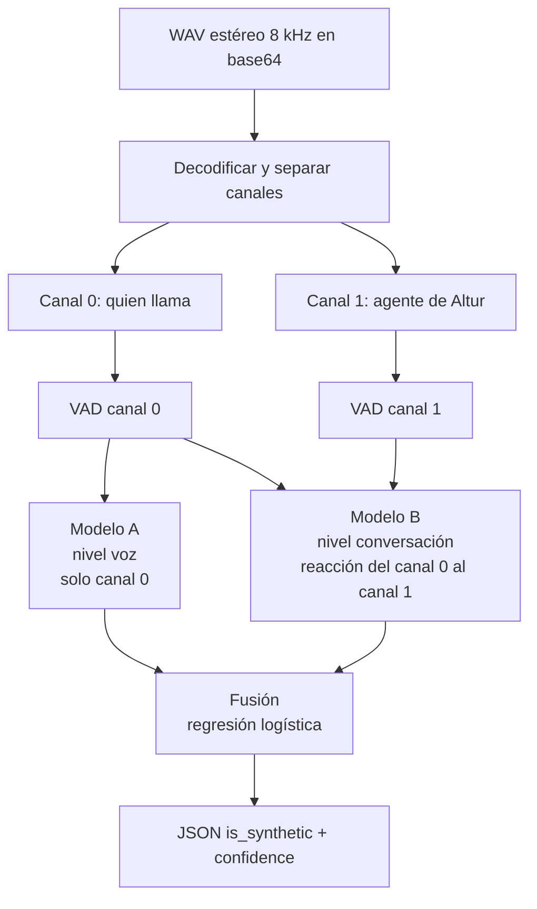

# VoiceGuard — Guía de Implementación v1.1
### Detección de agentes sintéticos en llamadas bancarias
**Reto Altur · HackMTY 2026 · 32 horas**

Equipo: Carlos Gloria · Fernando García · Aarón Hernández · Andrés Guzmán

> **Versión 1.1.** Revisión de [`IMPLEMENTACION.md`](IMPLEMENTACION.md) (commit `456478b`), que
> se conserva sin cambios. Cuando este texto dice "la versión anterior", se refiere a ese archivo.

---

> **🔎 Revisión técnica — 2026-09-12 (Fernando).** Se revisaron las
> herramientas, los procedimientos y el pipeline de esta guía contra:
> - el repo oficial del reto ([`alturio/hackmty26`](https://github.com/alturio/hackmty26));
> - el PDF de Altur;
> - la documentación de cada herramienta.
>
> Cada cambio está marcado en el texto con **🔎 Revisión** y resumido en la tabla de abajo. Lo
> que no tiene marca se mantiene como estaba.
>
> **Configuración general:** el proyecto debe correr en Google Colab, en Windows, Ubuntu o Arch,
> y en el servidor, sin atarse a uno solo. Cada herramienta explica por qué se usa y por qué no
> sus alternativas.

### Registro de cambios de la revisión

| # | Sección | Cambio | Por qué | Gravedad |
|---|---|---|---|---|
| 1 | 0, 12, 6 | La clave pasa de `is_syntethic` a **`is_synthetic`** | Así la escriben el README oficial y el PDF. Con la clave mal escrita, el benchmark automático puede no leer la respuesta | Crítica |
| 2 | 0, 12 | El endpoint recibe un **WAV estéreo en base64**, no un archivo *multipart*. Se quita `python-multipart` | Es el formato de la especificación oficial | Crítica |
| 3 | 1.1, 2 | Se clasifica a **quien llama (canal 0)**. El canal 1 es siempre el agente de IA de Altur | El reto no separa "humano-humano" de "agente-humano": en todas las llamadas contesta el agente de Altur | Crítica |
| 4 | 2, 10 | El Modelo A se aplica **solo al canal 0**. Se elimina "tomar el máximo sobre hablantes" | El canal 1 es una voz sintética en el 100% de las llamadas: el máximo daría "sintético" siempre | Crítica |
| 5 | 3, 4 | **No se convierte a mono**, y el VAD corre por canal sin `read_audio` de Silero | `ffmpeg -ac 1` y `read_audio` (Silero 5.1, verificado en su código) mezclan a quien llama con el agente | Crítica |
| 6 | 13 | **Se elimina nginx.** uvicorn atiende directo en el puerto 80 | nginx acepta 1 MB por defecto y responde 413; una llamada en base64 pesa hasta ~5.8 MB. uvicorn no tiene ese límite (probado: 30 MB → HTTP 200). Una pieza menos que configurar | Crítica |
| 7 | 1 | **Configuración general.** `requirements.txt` con versiones mínimas, sin comandos de un solo sistema y sin gestor de entornos obligatorio | Se trabajará en Colab y en Windows, Ubuntu y Arch, cada uno con otro Python (Arch trae 3.14). Las versiones fijadas antes (numpy 1.26.4, scipy 1.13.1, scikit-learn 1.5.1…) no tienen instaladores para 3.13/3.14, y matplotlib 3.9.1 no tiene para Windows con 3.12 | Alta |
| 8 | 2, 5 | Se elimina la atribución de hablante (resemblyzer + clustering) | El audio ya viene separado por canal. resemblyzer depende de `webrtcvad`, que hay que compilar | Alta |
| 9 | 2 | Datos reales: 353 llamadas (282 train / 71 val; 203 sintéticas / 150 humanas), sin IDs de hablante, y `turns/` calculados automáticamente | Conteo directo del `manifest.csv` y README oficial | Alta |
| 10 | 2 | Nueva tabla de **prioridades para 32 horas** | Altur recomienda profundidad sobre amplitud: una señal bien hecha gana a tres a medias | Alta |
| 11 | 6A | Rasgos **por evento**: cuánto tarda en ceder la palabra y cómo reacciona al silencio del agente. Dispersión robusta (IQR) en vez de solo CV. Cifras de Stivers corregidas. El "piso de latencia" se cita con datos | Es la pista explícita de Altur. El CV es inestable cuando la latencia media se acerca a 0 | Alta |
| 12 | 6C | Se quitan del plan base la **periodicidad de vocoder** y el **group delay** | La F0 de la voz humana (~80–250 Hz) cae en la misma banda que la "huella" de vocoder: la feature se enciende también con voz real. El group delay es inestable | Alta |
| 13 | 7 | Se quitan `time_stretch` y la ganancia aleatoria. Entra la aumentación **por códec** a ambas clases. ElevenLabs pasa a opcional | `time_stretch` altera las latencias y agrega artefactos de vocoder de fase; la ganancia no cambia nada tras normalizar | Alta |
| 14 | 9 | Validación: `val` oficial + `GroupKFold` por **grupos de voz**. Se agregan calibración, tiempo hasta decidir y prueba de fuga con el canal 1 | No existe `speaker_id`. Altur premia calibración y latencia | Alta |
| 15 | 3 | Ganancia constante en numpy en vez de `loudnorm` | `loudnorm` en una pasada es dinámico (ganancia variable en el tiempo) y sube internamente a 192 kHz | Media |
| 16 | 4 | Los `turns/` se usan como referencia, no como verdad | El README dice que se derivaron automáticamente del audio | Media |
| 17 | 6B | Temblor de F0 calculado por tramo sonoro continuo. Temblor y respiraciones pasan a experimentales. "Jitter ≈ 0 = sintético" queda como hipótesis | El código concatenaba tramos separados (crea saltos falsos). La banda telefónica corta por debajo de ~300 Hz | Media |
| 18 | 8 | Calibración **sigmoide** por defecto, regresión logística como línea base y `permutation_importance` | La isotónica sobreajusta con menos de ~1000 muestras (docs de scikit-learn) | Media |
| 19 | 10 | El fusor se entrena con predicciones **fuera de pliegue**. Se quita `n_hablantes` | Con scores sobre los mismos datos de entrenamiento, el fusor sobreconfía. Siempre hay 2 canales | Media |
| 20 | 11 | El baseline externo corre solo sobre `val`, offline. Se nombran modelos concretos con su licencia | Costo de CPU/RAM en el servidor y licencias no comerciales | Media |
| 21 | 12 | Si un audio válido falla al procesarse, se responde 200 con un valor por defecto; 400 solo para entradas inválidas | Un veredicto de 0.5 puntúa mejor que un error en un benchmark automático | Media |
| 22 | 7, 14 | "150 millones de llamadas" → "millones de llamadas". MongoDB guarda solo voces sintéticas | La cifra no tiene fuente (el PDF dice "millions"). El dataset prohíbe intentar identificar personas | Media |
| 23 | 4 (tabla), 5, 6, 8 (nueva) | Herramientas, riesgos, checklist y preguntas para los mentores actualizados | Consecuencia de los cambios anteriores | — |
| 24 | 1, 4 (tabla) | Se quitan **librosa** y **pyarrow** | librosa ya no se usa en ningún paso (LFCC sale de scipy) y arrastra `numba`. 353 filas de features caben en un CSV legible sin pyarrow | Media |
| 25 | 8, 12, 13 | El modelo guarda la **versión de scikit-learn** con que se entrenó, y el servidor instala esa misma | Si se entrena en Colab y se sirve en el servidor, un modelo guardado con joblib no está garantizado entre versiones de scikit-learn | Media |
| 26 | 8 (preguntas) | Preguntar si el audio se puede procesar en Colab / Google Drive | El dataset no se puede redistribuir, y subirlo a Google es procesarlo en la nube de un tercero | Media |

---

## 0. Resumen del proyecto

Construimos un sistema que recibe el audio de una llamada y determina si **quien llama** es una persona o un agente artificial. Devuelve además un nivel de confianza calibrado y una justificación auditable de la decisión.

> **🔎 Revisión (#3):** en todas las llamadas del dataset el otro participante (canal 1) es el
> agente de IA de Altur. Lo que se clasifica es el canal 0.

La tesis técnica del proyecto se resume en una frase:

> Un sintetizador moderno puede clonar el timbre de una voz casi a la perfección, pero no puede reproducir ni la mecánica involuntaria del aparato fonador ni la dinámica temporal de una conversación humana.

De ahí salen los dos ejes de detección. Uno mira **la voz** (¿hay un cuerpo produciendo este sonido?) y otro mira **la conversación** (¿este intercambio tiene ritmo humano?). El sistema final los combina.

**Entregable obligatorio:** endpoint `POST /detect`. Recibe un clip **WAV estéreo a 8 kHz codificado en base64** (canal 0 = quien llama, canal 1 = agente) y responde

```json
{ "is_synthetic": true, "confidence": 0.87 }
```

> **🔎 Revisión (#1, #2):** el README oficial y el PDF escriben `is_synthetic`; el
> `is_syntethic` de la versión anterior era un error de dedo. `is_synthetic` es obligatorio.
> `confidence` es opcional, pero Altur la usa para desempatar y para premiar sistemas bien
> calibrados.

---

## 1. Marco teórico del problema

### 1.1 Por qué esto no es detección de deepfake

El reto pide decidir, en llamadas entre quien llama y el agente de IA del banco, si **quien llama es una persona o un agente autónomo** (reconocimiento de voz + modelo de lenguaje + voz sintética). La diferencia con la detección de deepfake clásica no es cosmética: cambia el espacio de features disponible.

Un detector de deepfake recibe un archivo aislado y solo puede examinar la señal acústica. Nosotros recibimos una **interacción**, y eso habilita una familia entera de señales de nivel superior —turnos, latencias, solapamientos— que son inaccesibles para un detector de archivo.

Esto importa porque ya existen modelos anti-spoofing preentrenados y descargables (AASIST, RawNet2, wav2vec2 afinado en ASVspoof). Cualquier equipo puede clonarlos. Ninguno mira la estructura conversacional.

> **🔎 Revisión (#3, #11):** usar la conversación **no es exclusivo nuestro**. El PDF de Altur
> la propone como enfoque, junto con el acústico y el semántico, así que muchos equipos la
> intentarán. Lo defendible es hacerla **a fondo**: medir cómo reacciona quien llama a cada
> interrupción, silencio y encimada que el agente provoca a propósito (Paso 6A).

### 1.2 Las tres capas de evidencia

| Capa | Pregunta que responde | Fundamento | Prioridad (🔎 revisión) |
|---|---|---|---|
| **Conversacional** | ¿El intercambio tiene ritmo humano? | Restricciones cognitivas y de arquitectura de sistemas | **Núcleo** |
| **Fisiológica** | ¿Hay un aparato fonador biológico? | Biomecánica de la fonación | Secundaria, reducida |
| **Espectral / Fourier** | ¿Hay artefactos de síntesis en la señal? | Limitaciones de los vocoders | Secundaria, reducida |

Las tres son complementarias porque fallan en escenarios distintos:
- La conversacional falla si el atacante usa un agente *full-duplex*, que responde tan rápido como una persona.
- La fisiológica se degrada con audio muy comprimido, y el nuestro ya es telefónico a 8 kHz.
- La espectral es vulnerable a un vocoder nuevo que no hayamos visto.

> **🔎 Revisión (#10):** combinarlas solo da robustez si cada una funciona. El PDF de Altur
> dice que una señal bien hecha puntúa más que tres a medias. Por eso se construyen **en
> orden**: conversacional completa primero, y las otras solo si suman en la validación.
>
> Altur sugiere una cuarta capa, **semántica**: el agente pide repetir datos y pregunta por
> cosas que no existen; una persona dice "no tengo eso" y un modelo de lenguaje tiende a
> inventar. Queda **fuera del plan base** a propósito (requiere transcribir y un juez de
> texto) y solo se intenta si el núcleo está terminado.

---

## 2. Arquitectura del sistema

**El dataset** (README oficial y `manifest.csv`):
- **353 llamadas** WAV estéreo, 8 kHz, PCM 16 bits. **Canal 0 = quien llama; canal 1 = agente de Altur.**
- `manifest.csv` con `anon_id`, `label` (`human` / `synthetic`), `split` y `duration_s`:
  - train: 282 llamadas (169 sintéticas, 113 humanas);
  - val: 71 llamadas (34 sintéticas, 37 humanas).
- `turns/<anon_id>.json`: tramos de voz por canal, **derivados automáticamente del audio** (no son anotaciones manuales).
- train y val **no comparten hablantes**. El set oculto trae hablantes y voces que no están en ninguno. **No hay IDs de hablante ni audios de un solo canal.**

> **🔎 Revisión (#9):** la versión anterior suponía 300 llamadas balanceadas, audios de una sola
> persona y anotaciones de quién habla. Los datos reales son los de arriba. Las duraciones
> casi no distinguen las clases (media de 149.9 s en humanas contra 146.5 s en sintéticas).

Eso nos permite entrenar dos modelos con supervisión distinta y fusionarlos.



**Modelo A — nivel voz.** Entrenado con capas fisiológica y espectral sobre segmentos de voz **del canal 0**. Responde: *¿esta voz es sintética?*

**Modelo B — nivel conversación.** Entrenado con la capa conversacional: cómo responde el canal 0 a lo que hace el canal 1. Responde: *¿este intercambio tiene ritmo de agente?*

**Fusión.** Una regresión logística de dos entradas combina ambos scores. Si el canal 0 casi no tiene voz (un clip muy corto), se responde con el Modelo B o con el valor por defecto del Paso 12.

> **🔎 Revisión (#4):** se eliminó la rama "¿cuántos hablantes?" y el "Modelo A por hablante, se
> toma el máximo". El canal 1 es el agente de Altur, sintético en todas las llamadas: con el
> máximo, el sistema diría "sintético" siempre.

### Por qué esta separación importa

Multiplica los datos de entrenamiento. Con 282 llamadas de entrenamiento, el Modelo B tiene 282 ejemplos. Pero el Modelo A se entrena sobre **segmentos de voz**, y una llamada de dos a tres minutos aporta decenas.

> **🔎 Revisión:** los segmentos de una misma llamada **no son independientes**: son la misma voz
> en el mismo canal. El número efectivo de ejemplos sigue cerca del número de voces distintas.
> Por eso el score del Modelo A se agrega por llamada, y la validación agrupa por llamada y por
> voz (Paso 9).

Además, hace el sistema robusto a la entrada: si los jueces mandan un clip corto, el endpoint sigue respondiendo.

### Prioridades para 32 horas (🔎 revisión #10)

| Nivel | Pasos | Criterio |
|---|---|---|
| **Núcleo** (sin esto no hay entrega) | 1, 2, 3, 4, 6A, 8, 9, 12, 13 | Endpoint vivo con el Modelo B calibrado y validado |
| **Segundo** (si el núcleo está estable) | 6C reducido (LFCC + deltas + modulación), 6B reducido (F0, HNR, jitter, shimmer), 10 | Solo entra si mejora la validación agrupada |
| **Opcional** | 7 (códecs), 11 (baseline sobre `val`), 14 (demo progresiva), capa semántica | Diferenciadores para el pitch |
| **Eliminado** | Atribución de hablante con resemblyzer, periodicidad de vocoder, group delay | Innecesarios con audio estéreo, o dan falsos positivos (ver cada paso) |

---

## 3. Implementación paso a paso

### Paso 1 — Entorno de trabajo

**Qué se hace:** que cualquiera del equipo corra el mismo código donde trabaje —Google Colab, su laptop con Windows, Ubuntu o Arch, o el servidor— con las mismas dependencias.

**Principio (🔎 revisión #7):** el repo define **qué necesita** el proyecto, no **cómo montar** cada máquina. Cada quien usa el entorno que prefiera y corre:

```bash
pip install -r requirements.txt        # en una celda de Colab: !pip install -r requirements.txt
```

**`requirements.txt`:**

```
# Sin versiones exactas: pip elige la que tiene instalador para tu Python y tu sistema.
# Solo se pone mínimo donde el código usa una función que no existe en versiones anteriores.
numpy
scipy
soundfile
praat-parselmouth
silero-vad>=5.1          # load_silero_vad(); instala torch y torchaudio como dependencias
scikit-learn>=1.2        # AgglomerativeClustering(metric=...) en el Paso 9
pandas
matplotlib
fastapi
uvicorn
# opcional, solo para agrupar voces en la validación (Paso 9); no se usa en la API:
# speechbrain
```

**Justificación de cada decisión:**

*Por qué versiones mínimas y no exactas.* Cada entorno trae otro Python: Colab el suyo, Arch 3.14, Windows el que instaló cada quien. Las versiones exactas de la guía anterior solo tenían instaladores hasta Python 3.12:
- `numpy==1.26.4`, `scipy==1.13.1`, `scikit-learn==1.5.1`, `pandas==2.2.2` y `praat-parselmouth==0.4.3` no tienen instaladores para 3.13 ni 3.14. En Arch, pip intentaría compilarlas.
- `matplotlib==3.9.1` no tiene instalador para Windows con Python 3.12.

Las versiones actuales de todas las dependencias tienen instaladores para 3.12, 3.13 y 3.14 en Windows y Linux (verificado en PyPI).

*El único punto donde la versión sí debe coincidir* es scikit-learn, entre donde se entrena el modelo y el servidor que lo sirve (Pasos 8 y 13).

*Por qué no se fija un gestor de entornos* (venv, conda, uv, Docker):
- Colab no usa ninguno.
- La activación de `venv` cambia entre sistemas (`bin/activate` contra `Scripts\activate`).
- conda y Docker agregan instalación y peso sin resolver nada que `pip` + `requirements.txt` no resuelva aquí.

Quien quiera usar uno puede hacerlo: el archivo de dependencias es el mismo.

*Por qué no se usa GPU.* Los modelos son scikit-learn sobre ~45 features por llamada, y el VAD es una red de ~2 MB. Ninguno se acelera de forma relevante con GPU, así que en Colab **no hace falta pedir un entorno con GPU**. (La única vez que aparece la palabra CUDA en esta guía es en el Paso 13, para explicar por qué el servidor instala `torch` sin ella.)

*Por qué se quitaron librosa, pyarrow, resemblyzer, python-multipart y joblib/pydantic de la lista* (🔎 #24):
- **librosa:** ya no se usa en ningún paso (LFCC sale de scipy) y arrastra `numba`, que es pesado y suele tardar en soportar las versiones nuevas de Python.
- **pyarrow:** 353 filas de features caben en un CSV que cualquiera abre.
- **resemblyzer y python-multipart:** Pasos 5 y 12.
- **joblib y pydantic:** ya llegan como dependencias de scikit-learn y FastAPI.

**Datos.** El dataset **no va en el repo** (no se puede redistribuir y el zip pesa 671 MB). Cada quien lo tiene en su máquina o en su Drive. Las rutas de esta guía (`audio/`, `turns/`, `manifest.csv`) son relativas a la carpeta del dataset. En Colab la sesión se reinicia y borra archivos: las features y modelos se guardan en Drive, y el código vive en el repo.

**Criterio de éxito:** en Colab y en al menos una laptop de cada sistema del equipo, `pip install -r requirements.txt` termina y `python -c "import silero_vad, parselmouth, sklearn, soundfile, fastapi"` no falla.

---

### Paso 2 — Inventario y auditoría del dataset

**Qué se hace:** antes de escribir una sola feature, caracterizar el dataset y buscar sesgos que el modelo pudiera explotar.

**Herramientas:** `soundfile`, `pandas`, `scipy.signal.welch`, `matplotlib`.

```python
import soundfile as sf, pandas as pd

man = pd.read_csv("manifest.csv")                 # anon_id, label, split, duration_s
filas = []
for r in man.itertuples():
    info = sf.info(f"audio/{r.anon_id}.wav")
    filas.append({"anon_id": r.anon_id, "label": r.label, "split": r.split,
                  "sample_rate": info.samplerate, "canales": info.channels,
                  "subtipo": info.subtype, "duracion": info.duration})
df = pd.DataFrame(filas)
print(df.groupby(["sample_rate", "canales", "subtipo"]).size())
print(df.groupby("label")["duracion"].describe())
```

**La auditoría crítica — espectro promedio por clase, separando voz y silencio del canal 0:**

```python
import json
import numpy as np
from scipy.signal import welch

def mascara_voz(anon_id, n, sr, canal=0):
    m = np.zeros(n, bool)
    with open(f"turns/{anon_id}.json", encoding="utf-8") as f:
        turnos = json.load(f)["turns"]
    for t in turnos:
        if t["channel"] == canal:
            m[int(t["start"] * sr):int(t["end"] * sr)] = True
    return m

def psd_promedio(ids, tramo="voz", canal=0):
    acum = None
    for i in ids:
        y, sr = sf.read(f"audio/{i}.wav", always_2d=True)   # (muestras, 2)
        x = y[:, canal]
        m = mascara_voz(i, len(x), sr, canal)
        x = x[m] if tramo == "voz" else x[~m]
        f, P = welch(x, fs=sr, nperseg=512)
        acum = P if acum is None else acum + P
    return f, 10 * np.log10(acum / len(ids) + 1e-12)
```

Se grafica la densidad espectral de potencia promediada de cada clase sobre los mismos ejes, **una gráfica para voz y otra para silencio**.

> **🔎 Revisión:**
> - El código anterior no tenía la columna de etiqueta (hay que cruzar con `manifest.csv`) y
>   aplicaba `welch` a un arreglo estéreo sin elegir canal.
> - `encoding="utf-8"` explícito: en Windows, `open()` sin encoding usa la codificación del
>   sistema.
> - Los `turns/` se usan solo para explorar, no como entrada del modelo (ver advertencia del
>   Paso 4).

**Justificación teórica:** este es el paso que más proyectos hunde. Si las llamadas humanas provienen de telefonía real (banda 300–3400 Hz, códec con pérdida) y las sintéticas de un TTS a 24 kHz sin comprimir, existe un **atajo discriminante trivial**: la energía por encima de 4 kHz. Un clasificador entrenado así alcanza 99% de exactitud detectando el ancho de banda, no la síntesis, y colapsa ante audio de prueba homogéneo.

Formalmente, el modelo aprende una variable de confusión correlacionada con la etiqueta en el conjunto de entrenamiento pero no causalmente ligada al fenómeno. Es el mismo error que el clasificador famoso que distinguía lobos de perros detectando nieve en el fondo.

El teorema de muestreo de Nyquist-Shannon explica por qué se ve tan claro: una señal muestreada a 8 kHz no puede contener información por encima de 4 kHz, y ese corte queda como una huella nítida en el espectro.

> **🔎 Revisión:** según el README oficial **todo** el audio ya viene a 8 kHz, así que el atajo
> del ancho de banda es menos probable. Siguen siendo posibles otros atajos:
> - **Piso de ruido en los silencios.** Una voz inyectada digitalmente puede tener silencio casi
>   perfecto; una llamada real trae ruido de línea.
> - **Nivel de volumen.**
> - **El comportamiento del agente.** Si las llamadas sintéticas se grabaron con otra versión
>   del agente, el modelo aprendería la versión y no a quien llama.
>
> Dos pruebas rápidas:
> 1. PSD de **silencios** por clase.
> 2. Un modelo entrenado **solo con rasgos del canal 1**. Si acierta mucho, hay fuga: hay que
>    hablarlo con Altur antes de seguir.

**Criterio de éxito:**
- Las curvas de PSD de **silencio** y el nivel de volumen son indistinguibles entre clases.
- Un modelo que solo ve el canal 1 queda cerca del azar (AUC ≈ 0.5).
- Si las curvas de **voz** difieren, se documenta como posible señal legítima; no se "corrige".

**Responsable:** Fernando, hora 1–3.

---

### Paso 3 — Normalización del audio

**Qué se hace:** una sola función de carga, idéntica en entrenamiento y en la API. Sus reglas:
- mantener los dos canales separados;
- confirmar 8 kHz;
- aplicar una ganancia constante por canal.

**Herramientas:** `soundfile`, `numpy`, `scipy.signal.resample_poly` (solo si llegara otra frecuencia).

```python
from math import gcd
import numpy as np, soundfile as sf
from scipy.signal import resample_poly

def cargar_llamada(fuente):
    """Misma función en entrenamiento y en la API. Devuelve (canal0, canal1, sr) sin mezclar canales."""
    y, sr = sf.read(fuente, dtype="float32", always_2d=True)   # (muestras, canales)
    if sr != 8000:                                          # la especificación dice 8 kHz
        g = gcd(8000, sr)
        y = resample_poly(y, 8000 // g, sr // g, axis=0).astype("float32")
        sr = 8000
    llama = y[:, 0]
    agente = y[:, 1] if y.shape[1] > 1 else np.zeros_like(llama)
    return llama, agente, sr

def ganancia_constante(x, tramos_voz, sr, objetivo_dbfs=-26.0):
    """Una sola ganancia por canal, medida sobre la voz: jitter, shimmer y latencias no cambian."""
    if not tramos_voz:
        return x
    voz = np.concatenate([x[int(s["start"] * sr):int(s["end"] * sr)] for s in tramos_voz])
    rms = np.sqrt(np.mean(voz ** 2)) + 1e-9
    return x * (10 ** (objetivo_dbfs / 20) / rms)
```

La cadena por μ-law (`pcm_mulaw`) **solo** se aplica si la auditoría del Paso 2 muestra que el canal difiere entre clases. En ese caso se aplica a **ambas** clases.

**Justificación teórica, tres decisiones:**

*Por qué no se convierte a mono.* 🔎 **Revisión (#5):** la versión anterior usaba `ffmpeg -ac 1`, que **suma los dos canales**. Eso mezcla a quien llama con el agente y destruye la separación de la que depende toda la capa conversacional.

*Por qué 8 kHz y no 16.* Se toma siempre el mínimo común denominador. Sobremuestrear no añade información —el contenido por encima de 4 kHz simplemente no existe en la grabación original— pero sí introduce artefactos de interpolación que son detectables y sistemáticos por clase. Bajar, en cambio, solo descarta información, y la descarta por igual para ambas clases. Los jueces también mandan audio a 8 kHz.

*Por qué ganancia constante y no `loudnorm`.* El jitter y el shimmer son medidas **relativas y adimensionales**: el shimmer local es el cociente entre la diferencia media de amplitudes consecutivas y la amplitud media. Multiplicar toda la señal por **una constante** deja ese cociente invariante.

🔎 **Revisión (#15):** `loudnorm` **no** aplica una constante:
- En una sola pasada normaliza en modo **dinámico**, con una ganancia que cambia en el tiempo y subiendo internamente a 192 kHz.
- El modo lineal exige medir antes el archivo, y aun así vuelve a dinámico en ciertas condiciones (documentación de ffmpeg).

Una ganancia variable cambia la envolvente y el espectro de modulación, y sube el nivel de los silencios. La ganancia constante en numpy es exacta, más simple, funciona igual en cualquier sistema y no requiere ffmpeg en la API.

*Por qué μ-law solo si hace falta.* Es el códec de compansión estándar en telefonía en América. Aplica cuantización logarítmica, que preserva la relación señal-ruido relativa en señales de bajo nivel a costa de introducir ruido de cuantización no lineal. Si solo una clase lo atraviesa, ese ruido se vuelve el atajo. Si ambas lo atraviesan, se cancela como variable discriminante. Como todo el dataset ya es telefónico, no se aplica por defecto.

**Criterio de éxito:** `cargar_llamada()` devuelve dos canales a 8 kHz para las 353 llamadas, y la misma función está importada por el entrenamiento y por la API.

---

### Paso 4 — VAD y contraste con `turns/`

**Qué se hace:** segmentar **cada canal por separado** en tramos de voz y silencio, y contrastar el detector con los `turns/` del dataset.

**Herramientas:** `silero-vad`.

```python
import soundfile as sf, torch
from silero_vad import load_silero_vad, get_speech_timestamps

modelo_vad = load_silero_vad()

def segmentar(x, sr=8000, min_sil=300, umbral=0.5):
    """x: un solo canal (numpy float32). No usar read_audio: mezcla los canales."""
    return get_speech_timestamps(
        torch.from_numpy(x), modelo_vad,
        sampling_rate=sr,
        min_silence_duration_ms=min_sil,
        threshold=umbral,
        return_seconds=True,
    )

# llama, agente, sr = cargar_llamada(ruta)      # Paso 3
# tramos_llama, tramos_agente = segmentar(llama), segmentar(agente)
```

> **🔎 Revisión (#5):** el código anterior usaba `read_audio(ruta)`. En Silero 5.1 esa función
> convierte a un solo canal (`['channels', '1']`, revisado en su código fuente), así que sumaba
> quien llama y agente. Se lee con `soundfile` y se pasa cada canal por separado.
>
> **Por qué Silero y no un VAD por energía o WebRTC:**
> - **Por energía** (umbral de volumen) es lo más simple, pero confunde ruido de fondo con voz.
>   Las llamadas vienen de dispositivos y condiciones variadas.
> - **WebRTC VAD** no necesita `torch`, pero es un detector clásico más sensible al ruido.
> - **Silero** funciona a 8 kHz y es robusto al ruido. Su costo es instalar `torch`, que pip
>   resuelve solo como dependencia.
>
> Si en algún entorno `torch` diera problemas, `webrtcvad-wheels` es el respaldo: tiene
> instaladores para Windows y Linux.

**Contraste con `turns/` (por canal):**

```python
import numpy as np

def der(pred, real, dur_total, paso=0.01):
    """Detection Error Rate: fracción de tiempo mal etiquetado."""
    n = int(dur_total / paso)
    mp = np.zeros(n, bool); mr = np.zeros(n, bool)
    for s in pred: mp[int(s["start"]/paso):int(s["end"]/paso)] = True
    for s in real: mr[int(s["start"]/paso):int(s["end"]/paso)] = True
    return (mp != mr).mean()

# real_canal0 = [t for t in turns if t["channel"] == 0]
mejor = min(
    ((ms, th, evaluar_der(ms, th)) for ms in [200,300,400,500,700]
                                    for th in [0.3,0.4,0.5,0.6]),
    key=lambda x: x[2]
)
```

**Justificación teórica:** el VAD no es una feature, es la **base de referencia temporal** sobre la que se construye toda la capa conversacional. La latencia de turno se define como el intervalo entre el fin de un tramo de voz de un hablante y el inicio del siguiente tramo del otro. Si esos límites tienen error aleatorio de ±200 ms, la varianza medida de la latencia queda dominada por el error del detector y no por el fenómeno que queremos capturar. Las features de dispersión de latencia —nuestra apuesta principal— se convierten en ruido.

El parámetro `min_silence_duration_ms` tiene un compromiso claro. Demasiado corto, y las pausas de planificación dentro de una misma frase se interpretan como fin de turno, inflando artificialmente el número de turnos. Demasiado largo, y las respuestas rápidas se fusionan con el turno anterior, eliminando precisamente las latencias cortas que caracterizan al humano.

> **🔎 Revisión (#16):** el README oficial dice que los `turns/` se **derivaron automáticamente**
> del audio: no son anotaciones humanas. Optimizar el VAD para parecerse a ellos copia sus
> errores. El DER contra `turns/` sirve para detectar desacuerdos grandes; cuando haya
> desacuerdo, se escucha el tramo para decidir quién tiene razón.

**Advertencia de diseño — la más importante del documento:** los `turns/` se usan **solo para explorar y contrastar**, nunca como entrada al modelo. En producción el endpoint recibe un .wav desnudo. Si entrenamos con los límites de turno del dataset y en producción usamos límites estimados, existe un desajuste de distribución entre entrenamiento y prueba que degrada el modelo de forma silenciosa. El pipeline de entrenamiento debe invocar exactamente las mismas funciones que la API.

**Criterio de éxito:**
- DER por canal contra `turns/` por debajo de 10%, **o** desacuerdos explicados al escucharlos.
- Verificación visual sobre tres llamadas: la forma de onda de cada canal con los tramos detectados y los de `turns/` superpuestos.

---

### Paso 5 — Separación de canales (sustituye a la atribución de hablante)

> **🔎 Revisión (#8):** la versión anterior asignaba cada tramo a un hablante con `resemblyzer` y
> `AgglomerativeClustering`. El propio documento preveía que, si el audio venía en estéreo, este
> paso desaparecía. **Es el caso:** el README oficial confirma canal 0 = quien llama y canal 1 =
> agente. Se elimina el paso, y con él resemblyzer y su dependencia `webrtcvad` (hay que
> compilarla). También desaparece una fuente de error: un clustering que se equivoca contamina
> todas las features.

**Qué queda:** `cargar_llamada()` (Paso 3) ya devuelve los dos canales.

**Único uso de embeddings de voz:** formar **grupos de voz** para la validación (Paso 9), fuera de la API. Se usa `speechbrain/spkrec-ecapa-voxceleb` (Apache-2.0, ~83 MB, espera 16 kHz: se remuestrea el canal 0 solo para esto).

**Criterio de éxito:** cada llamada de train tiene asignado un grupo de voz, revisado escuchando una muestra de grupos.

---

### Paso 6A — Features conversacionales

**Qué se hace:** convertir el mapa de turnos de los dos canales en números que describan **cómo reacciona quien llama** (canal 0) a lo que hace el agente (canal 1).

**Herramientas:** `numpy` puro sobre la salida de los pasos 3 y 4.

**Primera acción (1 hora, antes de invertir más):** con los `turns/` provistos, graficar por clase en train la distribución de latencias de respuesta del canal 0. Si las clases no se separan, se replantea la prioridad antes de construir todo lo demás.

| Feature | Definición operativa |
|---|---|
| `latencia_mediana` | Mediana de (inicio de turno del canal 0 − fin del turno previo del canal 1) |
| `latencia_iqr` | Rango intercuartílico de esas latencias (dispersión robusta) |
| `latencia_cv` | `latencia_std / latencia_media` (secundaria: inestable si la media se acerca a 0) |
| `latencia_p10` | Percentil 10 de las latencias |
| `frac_anticipa` | Fracción de respuestas del canal 0 que empiezan antes de que termine el canal 1 |
| `ratio_solapamiento` | Fracción del tiempo total con ambos canales hablando |
| `interrupciones_min` | Turnos del canal 0 que empiezan mientras habla el canal 1, por minuto |
| `tasa_backchannel` | Tramos del canal 0 de menos de 0.6 s que ocurren mientras habla el canal 1, por minuto |
| `duracion_turno_cv` | Coeficiente de variación de la duración de turnos del canal 0 |
| `ratio_silencio` | Fracción del audio sin voz en ningún canal |
| `ceder_mediana`, `ceder_iqr` | Cuando el canal 1 empieza a hablar mientras habla el canal 0: segundos que el canal 0 sigue hablando |
| `reaccion_silencio` | Cuando el agente deja pasar más de ~2 s sin responder: segundos hasta que el canal 0 vuelve a hablar |
| `frac_silencio_sin_reaccion` | Fracción de esos silencios en los que el canal 0 no dice nada |

> **🔎 Revisión (#11):**
> - **Nuevos rasgos por evento** (`ceder_*`, `reaccion_silencio`, `frac_silencio_sin_reaccion`,
>   `frac_anticipa`). El PDF de Altur dice que en todas las llamadas el agente interrumpe, se
>   calla o habla encima. Una persona se recupera al instante y de forma desordenada; una
>   máquina, siempre igual. Es la pista más directa que dio Altur.
> - **Dispersión con IQR.** El CV explota cuando la latencia media se acerca a 0, que es justo
>   lo que hacen los humanos (moda de 0 ms, ver abajo).
> - **Dirección explícita** (canal 1 → canal 0). Las latencias del **agente** dependen del
>   sistema de Altur y no deben entrar al modelo; solo se usan en la prueba de fuga del Paso 2.
> - **Umbral de ~2 s.** Es una propuesta: se ajusta mirando los datos.

**Justificación teórica.** Aquí hay dos argumentos independientes que convergen.

*Desde la lingüística.* Stivers y colaboradores (PNAS, 2009) midieron el tiempo de respuesta en diez lenguas no relacionadas:
- La **moda global** del intervalo entre turnos es **0 ms** (entre 0 y +200 ms según la lengua).
- La media entre lenguas es **+208 ms**, y las medias de cada lengua quedan a ≈250 ms de ella: de +7 ms en japonés a +469 ms en danés.
- Los hablantes **evitan el solapamiento**: en italiano, por ejemplo, solo 17% de las respuestas se enciman.
- Además **minimizan el silencio**.

Responder en torno a 0 ms solo es posible porque el oyente **predice** el final del enunciado en vez de esperar a detectarlo. Es una universal conversacional: aparece en todas las lenguas estudiadas.

> **🔎 Revisión:** la versión anterior decía que "una fracción sustancial de respuestas se
> anticipa produciendo solapamiento". El artículo dice lo contrario: el solapamiento es
> minoritario; lo universal es la respuesta rápida y la evitación de silencios.

*Desde la arquitectura de sistemas.* Un agente conversacional encadena detección de fin de turno, transcripción, inferencia del modelo de lenguaje y síntesis de voz. Cada etapa impone una latencia mínima.

En Full-Duplex-Bench (ASRU 2025), la latencia para tomar el turno fue:
- **0.95 s** en Freeze-Omni;
- **1.30 s** en Gemini Live;
- **0.27 s** en **Moshi**, un modelo *full-duplex* que escucha y habla a la vez.

> **🔎 Revisión (#11):** la versión anterior afirmaba un piso de "400–500 ms" sin fuente. Los
> números de arriba sí tienen fuente, y muestran que **el piso no es universal**: un agente
> *full-duplex* responde casi como una persona, y el set oculto trae motores no vistos. Por eso
> el Modelo A no se abandona.
>
> La hipótesis de **varianza baja** ("el mismo pipeline se ejecuta cada vez") es razonable pero
> **no está demostrada**: la latencia del modelo de lenguaje y del TTS cambia con la longitud de
> la respuesta y con la red. Se mide en train antes de apostar por ella.

De ahí que la **dispersión de la latencia** (`latencia_iqr`, y `latencia_cv` como secundaria) y los rasgos **por evento** sean los candidatos principales: no miden velocidad sino consistencia. Un humano cuyas respuestas van de 0 a 2 segundos según la complejidad de la pregunta tiene dispersión alta; un sistema determinista la tendría baja. Y `latencia_p10` captura el piso arquitectónico de un agente en cascada, que no puede responder instantáneamente.

El solapamiento y los backchannels refuerzan lo mismo desde otro ángulo. Los marcadores de escucha activa —"ajá", "mhm", "sí"— se producen *mientras el otro habla*, requieren procesamiento incremental del enunciado en curso, y los agentes comerciales rara vez los generan porque su arquitectura es estrictamente por turnos.

**Responsable:** Fernando.

---

### Paso 6B — Features fisiológicas

**Qué se hace:** medir las huellas involuntarias del aparato fonador **en los tramos de voz del canal 0**.

**Herramientas:** `praat-parselmouth`, `scipy.signal`, `numpy.fft`.

```python
import parselmouth
from parselmouth.praat import call

def features_fisiologicas(segmento, sr=8000):
    """segmento: numpy float64 de un tramo de voz del canal 0."""
    snd = parselmouth.Sound(segmento, sampling_frequency=sr)
    pp = call(snd, "To PointProcess (periodic, cc)", 60, 400)
    return {
        "jitter_local":  call(pp, "Get jitter (local)", 0,0, 1e-4, 0.02, 1.3),
        "jitter_rap":    call(pp, "Get jitter (rap)",   0,0, 1e-4, 0.02, 1.3),
        "shimmer_local": call([snd, pp], "Get shimmer (local)",
                              0,0, 1e-4, 0.02, 1.3, 1.6),
        "hnr": call(snd.to_harmonicity_cc(), "Get mean", 0, 0),
    }
```

**Temblor fisiológico vía FFT del contorno de F0 (experimental):**

```python
import numpy as np

def temblor_f0(snd, fs_f0=100, min_frames=64):
    """Energía 4–12 Hz del contorno de F0, calculada por tramo sonoro continuo."""
    f0 = snd.to_pitch(time_step=1/fs_f0).selected_array["frequency"]
    tramos, actual = [], []
    for v in f0:
        if v > 0:
            actual.append(v)
        else:
            if len(actual) >= min_frames:
                tramos.append(np.array(actual))
            actual = []
    if len(actual) >= min_frames:
        tramos.append(np.array(actual))
    if not tramos:
        return np.nan
    fracciones = []
    for t in tramos:
        t = t - t.mean()
        ESP = np.abs(np.fft.rfft(t))
        frec = np.fft.rfftfreq(len(t), d=1/fs_f0)
        banda = (frec >= 4) & (frec <= 12)
        fracciones.append(ESP[banda].sum() / (ESP.sum() + 1e-12))
    return float(np.median(fracciones))
```

> **🔎 Revisión (#17):** el código anterior hacía `f0 = f0[f0 > 0]`. Eso **pega** tramos sonoros
> de sílabas distintas: cada unión es un salto artificial de F0 que llena el espectro, así que
> la banda 4–12 Hz medía los cortes y no el temblor. Ahora se calcula por tramo continuo.
> Tramos sonoros de 0.64 s seguidos son poco comunes en habla rápida: esperar muchos `NaN`.

| Feature | Qué mide | Prioridad (🔎) |
|---|---|---|
| `jitter_local`, `jitter_rap` | Perturbación del periodo fundamental ciclo a ciclo | Segundo nivel |
| `shimmer_local` | Perturbación de la amplitud ciclo a ciclo | Segundo nivel |
| `hnr` | Relación entre energía armónica y energía de ruido | Segundo nivel |
| `f0_std`, `f0_rango` | Dispersión de la entonación | Segundo nivel |
| `delta_f0_std` | Desviación de la primera diferencia del contorno de F0 | Segundo nivel |
| `temblor_4_12hz` | Fracción de energía del contorno de F0 en la banda del temblor | Experimental |
| `respiraciones_min` | Eventos de inhalación detectados por minuto | Experimental |

**Justificación teórica.** La fonación humana es un fenómeno biomecánico, no un oscilador ideal. Las cuerdas vocales son tejido con propiedades viscoelásticas no lineales, y su vibración está gobernada por control neuromuscular que tiene ruido intrínseco. El resultado es que ningún ciclo glótico es idéntico al anterior.

El **jitter** cuantifica esa irregularidad en el eje del periodo y el **shimmer** en el eje de la amplitud. Praat, siguiendo a MDVP, usa 1.04% de jitter local como umbral de patología.

> **🔎 Revisión (#17):** "un valor cercano a cero indica que no hay tejido vibrando" pasa a
> **hipótesis**. Los vocoders neuronales se entrenan con voz humana y pueden reproducir
> microvariaciones. Además, el códec telefónico agrega irregularidad a ambas clases. Solo va
> al pitch si los datos lo muestran.

El **HNR** captura el problema complementario. Durante la fonación normal, parte del flujo de aire atraviesa la glotis de forma turbulenta y genera ruido de aspiración de banda ancha. La hipótesis es que un sintetizador que modela solo la parte armónica produzca HNR anormalmente alto; el ruido de línea telefónica baja el HNR de ambas clases, así que se compara siempre dentro del mismo canal.

El **temblor de 4 a 12 Hz** merece explicación aparte porque es la feature más específica del conjunto. Los músculos laríngeos presentan temblor fisiológico involuntario en ese rango, resultado del control motor de lazo cerrado. Ese temblor modula la frecuencia fundamental. Aplicar una FFT al contorno de F0 —tratándolo como una serie temporal muestreada a 100 Hz— revela esa componente. Un TTS genera prosodia mediante interpolación de contornos suaves y no tiene ninguna razón para producir energía en esa banda.

La **respiración** es la señal más intuitiva. La fonación humana requiere ciclos respiratorios, y cada inhalación deja una ráfaga de energía de banda ancha y baja intensidad antes del enunciado.

> **🔎 Revisión (#17):** la versión anterior filtraba en 50–400 Hz. La telefonía de banda estrecha
> transmite aproximadamente 300–3400 Hz, así que casi toda esa banda llega atenuada. Además, la
> supresión de ruido de algunos códecs y teléfonos puede borrar las inhalaciones. Pasa a
> **experimental**: si se intenta, filtrar en 300–3400 Hz y buscar solo en los tramos sin voz del
> canal 0.

**Limitación honesta que hay que documentar:** a 8 kHz, un periodo de una voz de 100 Hz ocupa 80 muestras, y un jitter del 1% equivale a menos de una muestra. Praat obtiene precisión sub-muestral mediante correlación cruzada con interpolación parabólica, de modo que la medición sigue siendo utilizable, pero es más ruidosa que a 16 kHz. Todo el dataset ya viene a 8 kHz, así que no hay alternativa. Se asume la degradación y se compensa promediando (con mediana) sobre múltiples segmentos del mismo canal.

*Por qué parselmouth y no otra librería:* es Praat, el estándar de fonética clínica, con instaladores para Windows y Linux. Su licencia es GPL-3: sirve para el prototipo, pero hay que tenerlo presente si un banco lo integrara en un producto.

**Responsable:** Andrés.

---

### Paso 6C — Features espectrales y de Fourier

**Qué se hace:** extraer artefactos de síntesis de la señal mediante análisis en el dominio de la frecuencia, **solo sobre los tramos de voz del canal 0**.

**Herramientas:** `scipy.signal.stft`, `scipy.fft`.

#### LFCC en lugar de MFCC

```python
from scipy.signal import stft
from scipy.fftpack import dct
import numpy as np

def lfcc(y, fs=8000, n_filtros=20, n_coef=20):
    f, t, Z = stft(y, fs=fs, nperseg=256, noverlap=176)
    pot = np.abs(Z)**2
    bordes = np.linspace(0, fs/2, n_filtros + 2)
    banco = np.zeros((n_filtros, len(f)))
    for i in range(n_filtros):
        izq, cen, der = bordes[i], bordes[i+1], bordes[i+2]
        banco[i] = np.clip(np.minimum((f-izq)/(cen-izq), (der-f)/(der-cen)), 0, None)
    log_e = np.log(banco @ pot + 1e-10)
    return dct(log_e, type=2, axis=0, norm="ortho")[:n_coef]

# Por llamada: LFCC + deltas (np.diff sobre el eje temporal) de cada tramo de voz del canal 0,
# resumidos en media y desviación estándar por coeficiente.
```

**Justificación teórica.** La escala mel es una función de compresión perceptual: fue construida a partir de experimentos psicoacústicos sobre cómo los humanos juzgan distancias de altura tonal, y comprime logarítmicamente por encima de aproximadamente 1 kHz. Los MFCC heredan esa compresión, lo cual es ideal para reconocimiento de habla —donde queremos representar lo que el oído percibe— pero contraproducente aquí.

El razonamiento es directo: los artefactos de vocoder tienden a aparecer en las frecuencias altas, y la escala mel asigna precisamente ahí la menor resolución. Un banco de filtros lineal mantiene resolución uniforme en todo el rango. Sahidullah y colaboradores (Interspeech 2015) compararon rasgos en ASVspoof 2015 y encontraron más útiles los que representan la región de **frecuencias altas**, la **dinámica** (deltas) y el detalle por sub-bandas.

> **🔎 Revisión:**
> - **A 8 kHz la ventaja se reduce:** lo que está por encima de 4 kHz ya no existe en nuestro
>   audio. LFCC sigue siendo razonable porque da resolución uniforme hasta 4 kHz.
> - **Se agregan deltas**, porque el mismo estudio encontró útil la información dinámica.
> - **Se calcula solo sobre voz del canal 0.** Con silencios incluidos, el modelo aprendería el
>   ruido de fondo.
> - **Por qué scipy y no librosa:** LFCC no viene en librosa, así que igual había que escribirlo,
>   y scipy ya está en el proyecto. librosa se quitó (#24).

La **DCT** final decorrela las log-energías del banco de filtros, que están fuertemente correlacionadas entre filtros vecinos, y concentra la envolvente espectral (el tracto vocal) en los primeros coeficientes. Con solo 20 filtros, la estructura fina de la fuente glótica queda suavizada, así que no conviene interpretar los coeficientes altos como "la fuente".

#### Espectro de modulación

```python
def espectro_modulacion(y, fs=8000):
    """y: un tramo continuo de voz del canal 0 (≥ 1.5 s)."""
    f, t, Z = stft(y, fs=fs, nperseg=256, noverlap=192)
    env = np.abs(Z)
    env = env - env.mean(axis=1, keepdims=True)
    MOD = np.abs(np.fft.rfft(env, axis=1)).mean(axis=0)
    fmod = np.fft.rfftfreq(env.shape[1], d=(t[1]-t[0]))
    e_baja = MOD[(fmod>=2)&(fmod<=8)].sum()
    e_alta = MOD[(fmod>8)&(fmod<=20)].sum()
    return {"mod_2_8": e_baja, "mod_8_20": e_alta,
            "mod_ratio": e_baja/(e_alta+1e-12),
            "mod_pico": fmod[np.argmax(MOD)]}
```

> **🔎 Revisión:** se calcula **por tramo continuo de voz** y se promedia por llamada. Sobre el
> canal completo, la alternancia entre voz y silencio de la conversación dominaría el espectro
> de modulación, y la feature repetiría lo que ya mide el Paso 6A.

**Justificación teórica.** El espectro de modulación aplica una segunda transformada de Fourier sobre la evolución temporal de la energía en cada banda. Captura el **ritmo** de la señal, no su contenido espectral instantáneo.

El habla humana presenta un máximo pronunciado alrededor de 4–5 Hz. Esa cifra no es arbitraria: corresponde a la tasa silábica, que está acotada por la inercia mecánica de los articuladores —mandíbula, lengua, labios son masas físicas que no pueden acelerarse indefinidamente. Es una restricción biomecánica del mismo tipo que las del Paso 6B, pero medible a nivel de envolvente en lugar de a nivel de ciclo glótico.

Los sistemas de síntesis producen perfiles de modulación distintos: a menudo más dispersos, o con concentración en frecuencias que no corresponden a ninguna restricción articulatoria real.

#### Descartado del plan base: group delay y periodicidad de vocoder

> **🔎 Revisión (#12):**
>
> **Periodicidad de vocoder (40–200 Hz en la envolvente) — eliminada.** La idea era buscar un
> pico a la frecuencia de bloque del vocoder (80–100 Hz) y tratarlo como "prácticamente
> concluyente". El problema:
> - La envolvente de **cualquier voz humana sonora** es periódica a su frecuencia fundamental,
>   ~80–250 Hz, justo en esa banda. La feature se enciende con voz real y confunde voces graves
>   con sintéticas.
> - Los códecs celulares y de VoIP (AMR-NB, Opus) trabajan en tramas de 20 ms y agregan su propia
>   periodicidad a ambas clases.
>
> **Group delay — fuera del plan base.** El documento ya advertía que es numéricamente inestable
> y que la versión robusta (*modified group delay*) no es trivial. Además, la fase pasa por el
> canal telefónico y sus códecs antes de llegarnos, así que mediría en buena parte el canal. Con
> 32 horas, el costo no se justifica frente a las demás features.

#### Advertencia sobre dimensionalidad

**No se introducen bins crudos de FFT al modelo.** Un espectrograma de 129 bins por 200 ventanas son más de 25,000 valores por archivo. Con un dataset de este tamaño, eso garantiza sobreajuste: el modelo memoriza el ruido de fondo de cada grabación en lugar de aprender el fenómeno.

Fourier es el paso intermedio, no la feature. Todo lo que sale de una transformada debe colapsarse a un puñado de estadísticos —medias, desviaciones, energías por banda, cocientes— antes de entrar al vector. **Presupuesto total: 35 a 45 features.**

**Responsable:** Carlos.

---

### Paso 7 — Aumentación de datos (opcional)

**Qué se hace:** hacer al Modelo A robusto a **condiciones de llamada** distintas, pasando la voz del canal 0 por códecs telefónicos. Opcionalmente, ampliar la clase sintética con voz generada por nosotros.

**Herramientas:** ffmpeg (fuera de la API), `numpy`. Opcional: ElevenLabs (API).

```python
# Aumentación por códec: ida y vuelta por ffmpeg, a AMBAS clases, solo para el Modelo A.
# La entrada es un WAV mono con un tramo del canal 0 (aquí sí se puede usar -ac 1).
import os, subprocess, tempfile

CODECS = {
    "mulaw": (["-c:a", "pcm_mulaw"], "wav"),
    "alaw":  (["-c:a", "pcm_alaw"], "wav"),
    "amrnb": (["-c:a", "libopencore_amrnb", "-b:a", "7.4k"], "amr"),
    "opus":  (["-c:a", "libopus", "-b:a", "8k", "-application", "voip"], "ogg"),
}

def por_codec(entrada_wav, salida_wav, codec):
    opciones, ext = CODECS[codec]
    with tempfile.TemporaryDirectory() as d:
        tmp = os.path.join(d, f"tmp.{ext}")
        subprocess.run(["ffmpeg", "-y", "-loglevel", "error", "-i", entrada_wav,
                        "-ar", "8000", "-ac", "1", *opciones, tmp], check=True)
        subprocess.run(["ffmpeg", "-y", "-loglevel", "error", "-i", tmp,
                        "-ar", "8000", "-ac", "1", "-c:a", "pcm_s16le", salida_wav], check=True)
```

**ffmpeg se necesita solo donde se corra este paso** (una vez, offline). Debe traer `libopencore_amrnb` y `libopus`. Se comprueba con `ffmpeg -hide_banner -encoders`, buscando `amrnb` y `opus` en la lista.

| Dónde | Cómo obtener un ffmpeg con AMR-NB y Opus |
|---|---|
| Windows | Build *essentials* de gyan.dev (incluye `libopencore-amrnb` y `libopus`) |
| Arch | Paquete `ffmpeg` oficial (depende de `opencore-amr` y `opus`) |
| Ubuntu y Colab (Colab corre sobre Ubuntu) | Paquetes `ffmpeg` y `libavcodec-extra`: el paquete base de Ubuntu no trae AMR-NB |

*Por qué ffmpeg y no una librería de Python:* AMR-NB y Opus necesitan los códecs reales. ffmpeg los trae en los tres sistemas, y como solo corre offline para generar datos, no agrega ninguna dependencia a la API ni a las demás máquinas.

> **🔎 Revisión (#13):** se quitaron tres perturbaciones del código anterior:
> - **`librosa.effects.time_stretch`.** Cambia la duración de turnos, pausas y velocidad del
>   habla, es decir, las features del Modelo B. Además, al ser un vocoder de fase, agrega a la
>   voz humana el mismo tipo de artefacto que queremos detectar.
> - **Ganancia aleatoria.** Tras la ganancia constante del Paso 3 y con features relativas, no
>   cambia nada.
> - **Ruido blanco fijo.** Se reemplaza por ruido de fondo opcional con SNR de 20–30 dB (propuesta).
>
> Entra la **aumentación por códec**. Un informe de Phonexia y la Universidad Tecnológica de Brno
> (preprint 2026, mediciones internas ilustrativas) reporta EER de ~16% con AMR-NB y ~25% con
> G.711 sin aumentación por códec: agregarla cerró buena parte de la brecha, y la aumentación
> genérica casi no ayudó.

**Justificación teórica.** Con 282 llamadas de entrenamiento, la relación entre número de ejemplos y número de parámetros efectivos es desfavorable. La aumentación actúa como regularizador: al presentar el mismo contenido bajo múltiples condiciones de canal, se fuerza al modelo a aprender representaciones invariantes a esas condiciones, que es exactamente la propiedad que necesitamos para generalizar al audio de evaluación.

**Restricción crítica:** toda perturbación de canal debe aplicarse **a ambas clases por igual**. Aumentar solo la clase sintética introduciría el mismo sesgo que intentamos eliminar, solo que en dirección contraria. **Las copias aumentadas de una llamada van en el mismo grupo de validación que la original** (Paso 9); si no, el modelo se evalúa con variantes de audios que ya vio.

**ElevenLabs (opcional).** Puede aportar diversidad de motores de voz, lo que ayuda ante "motores no vistos". Tiene tres límites:
- Genera **monólogos sin el agente de Altur**, así que no sirve para el Modelo B.
- Si solo la clase sintética recibe audio "generado por nosotros", el modelo puede aprender ese dominio. Hay que pasarlo por la misma cadena de códec y medir con ablación si mejora la validación.
- Nunca entra a `val` ni a la prueba. Solo con voces de integrantes del equipo que den su consentimiento.

**Responsable:** Aarón.

---

### Paso 8 — Modelos A y B

**Qué se hace:** entrenar los dos clasificadores base.

**Herramientas:** `scikit-learn`.

```python
from sklearn.ensemble import RandomForestClassifier
from sklearn.linear_model import LogisticRegression
from sklearn.calibration import CalibratedClassifierCV
from sklearn.pipeline import make_pipeline
from sklearn.preprocessing import StandardScaler
from sklearn.impute import SimpleImputer

def construir_lineal():
    """Línea base: pocos parámetros e interpretable por coeficientes."""
    base = LogisticRegression(C=0.5, max_iter=2000, class_weight="balanced")
    return make_pipeline(SimpleImputer(strategy="median"), StandardScaler(),
                         CalibratedClassifierCV(base, method="sigmoid", cv=5))

def construir():
    base = RandomForestClassifier(
        n_estimators=500, max_depth=10, min_samples_leaf=3,
        max_features="sqrt", class_weight="balanced", random_state=42)
    return make_pipeline(
        SimpleImputer(strategy="median"),
        StandardScaler(),
        CalibratedClassifierCV(base, method="sigmoid", cv=5),
    )
```

**Guardar el modelo junto con la versión de scikit-learn** (🔎 #25):

```python
import joblib, sklearn

bundle = {"modelo": modelo_final, "version": "v1",
          "sklearn": sklearn.__version__,        # el servidor debe instalar esta misma versión
          "prior": float(y.mean())}              # fracción sintética en train: respuesta por defecto (Paso 12)
joblib.dump(bundle, "models/model.joblib")
```

*Por qué guardar la versión:* es probable entrenar en Colab y servir en otra máquina. scikit-learn no garantiza que un modelo guardado con una versión cargue igual en otra; al cargarlo con una versión distinta emite `InconsistentVersionWarning`. Anotar la versión en el mismo archivo permite instalar exactamente esa en el servidor.

**Justificación teórica, tres decisiones:**

*Por qué Random Forest y no una red neuronal.* Con features diseñadas a mano de dimensión moderada y pocos cientos de ejemplos, los métodos de ensemble basados en árboles dominan empíricamente. El bagging reduce varianza sin incrementar sesgo apreciablemente, los árboles capturan interacciones no lineales sin necesidad de especificarlas, y no hay hiperparámetros críticos que ajustar con un presupuesto de tiempo limitado. Una red profunda requeriría órdenes de magnitud más datos para superar este baseline.

> **🔎 Revisión (#18):**
> - **Primero la regresión logística**, y el Random Forest se queda solo si mejora la validación
>   agrupada. Con 282 llamadas y 35–45 features, un modelo lineal regularizado es una línea base
>   honesta y se explica por sus coeficientes.
> - **`permutation_importance` en vez de `feature_importances_`.** La importancia por impureza del
>   Random Forest favorece features con muchos valores distintos (advertencia de la documentación
>   de scikit-learn).

*Por qué calibración sigmoide.* Las probabilidades que emite un Random Forest son promedios de votos de árboles, y ese promediado las sesga hacia el centro del intervalo: valores extremos se vuelven raros y la distribución se concentra alrededor de 0.5. El reto usa `confidence` para desempatar y premiar calibración, así que ese número debe ser interpretable: entre los casos con confianza reportada de 0.87, aproximadamente el 87% deberían resultar efectivamente sintéticos.

> **🔎 Revisión (#18):** la versión anterior prefería la regresión **isotónica**. La documentación de
> scikit-learn la recomienda para conjuntos grandes (más de ~1000 muestras) y advierte que
> sobreajusta con pocos datos. Con `cv=5` sobre 282 llamadas, cada calibrador se ajusta con ~56.
> Se usa **sigmoide (Platt)** por defecto y se compara contra isotónica con el Brier score en `val`.

*Por qué `class_weight="balanced"`.* El dataset **no** está balanceado: tiene 57.5% sintéticas (203 contra 150), y la segmentación por hablante lo desbalancea todavía más. El parámetro pondera inversamente a la frecuencia de clase y previene el sesgo hacia la mayoritaria. La proporción del set oculto no se conoce (pregunta para los mentores).

---

### Paso 9 — Validación

**Qué se hace:** estimar el rendimiento real del sistema sin autoengañarse.

**Herramientas:** `sklearn.model_selection.GroupKFold`, `sklearn.metrics`, `sklearn.calibration.calibration_curve`.

```python
from sklearn.cluster import AgglomerativeClustering
from sklearn.model_selection import GroupKFold
from sklearn.metrics import roc_auc_score, roc_curve, brier_score_loss, balanced_accuracy_score
import numpy as np

def eer(y_true, y_score):
    fpr, tpr, _ = roc_curve(y_true, y_score)
    fnr = 1 - tpr
    i = np.nanargmin(np.abs(fnr - fpr))
    return (fpr[i] + fnr[i]) / 2

# No hay speaker_id en manifest.csv: se aproximan grupos de voz con embeddings ECAPA
# del canal 0 (un vector por llamada de train). Ajustar el umbral escuchando algunos grupos.
grupos = AgglomerativeClustering(n_clusters=None, distance_threshold=0.6,
                                 metric="cosine", linkage="average").fit_predict(emb)

gkf = GroupKFold(n_splits=5)
for tr, te in gkf.split(X, y, groups=grupos):   # agrupar por VOZ (y por llamada en el Modelo A)
    ...
```

**Justificación teórica.** La partición debe agrupar por **identidad de hablante**, no por archivo ni por llamada. Si un mismo locutor aparece en entrenamiento y en prueba, el modelo puede alcanzar exactitud alta memorizando características idiosincráticas de esa voz particular en lugar de aprender el fenómeno de la síntesis. La métrica resultante sería optimista y no predeciría nada sobre el comportamiento ante voces nuevas, que es exactamente el escenario de evaluación.

Esta es una forma de fuga de datos particularmente insidiosa porque no produce ningún síntoma visible: el modelo simplemente reporta un número excelente que resulta ser ficción.

> **🔎 Revisión (#14):**
> - **No existe `speaker_ids`.** `manifest.csv` solo trae `anon_id`, `label`, `split` y
>   `duration_s`.
> - **La evaluación principal es el `val` oficial**, que ya no comparte hablantes con train.
> - **Dentro de train**, los grupos se aproximan agrupando voces del canal 0. Esto importa sobre
>   todo para las voces **sintéticas**, que probablemente se repiten en muchas llamadas.
> - **Modelo A:** los segmentos de una llamada nunca se separan entre pliegues.

El **EER** —punto de operación donde la tasa de falsos positivos iguala a la de falsos negativos— es la métrica estándar en la literatura de verificación de locutor y anti-suplantación. Reportarla permite comparación directa con los resultados publicados de ASVspoof y demuestra familiaridad con el campo.

Se reportan además AUC, matriz de confusión al umbral 0.5, y curva de calibración.

> **🔎 Revisión (#14):** también se reportan:
> - **Exactitud balanceada**, porque las clases no están parejas.
> - **Brier score**, porque Altur premia la calibración.
> - **Curva de tiempo hasta decidir**: exactitud usando solo los primeros 15, 30, 60 y 90 s de la
>   llamada (criterio de latencia).
> - **La prueba de fuga del Paso 2** (modelo solo con el canal 1).
>
> Con 71 llamadas en `val`, un error mueve la exactitud 1.4 puntos: reportar intervalos por
> *bootstrap*.

---

### Paso 10 — Fusión

```python
from sklearn.linear_model import LogisticRegression
from sklearn.model_selection import GroupKFold, cross_val_predict

cv = GroupKFold(n_splits=5)
# score_A: por llamada, promedio de log-odds de sus segmentos del canal 0 (predicciones fuera de pliegue)
score_B = cross_val_predict(construir(), X_B, y, groups=grupos, cv=cv, method="predict_proba")[:, 1]
Z = np.column_stack([score_A, score_B])
fusor = LogisticRegression(max_iter=1000).fit(Z, y)
```

**Justificación teórica.** La fusión a nivel de score (*late fusion*) es preferible a concatenar todas las features en un solo vector (*early fusion*) por tres razones en este contexto:
1. Los dos modelos se entrenan sobre unidades de análisis distintas —segmentos de voz versus llamadas completas— y con cantidades de datos muy diferentes; concatenar obligaría a usar la unidad más restrictiva.
2. Permite que el sistema degrade con elegancia: si el canal 0 casi no tiene voz, se usa el Modelo B.
3. Mantiene la interpretabilidad: los coeficientes del fusor dicen explícitamente cuánto pesa la evidencia acústica frente a la conversacional.

> **🔎 Revisión (#19):**
> - **El fusor aprende de predicciones fuera de pliegue** (`cross_val_predict`). Con scores
>   calculados sobre los mismos datos con que se entrenaron los modelos, esos scores salen casi
>   perfectos, y el fusor aprende a confiar de más.
> - **Se quitó `n_hablantes == 2`.** Siempre hay dos canales, así que no aporta información.

---

### Paso 11 — Baseline externo (opcional)

**Qué se hace:** ejecutar un modelo anti-spoofing preentrenado **sobre `val`, offline** (Colab sirve para esto).

**Herramientas:** modelos de Hugging Face, por ejemplo:
- `Gustking/wav2vec2-large-xlsr-deepfake-audio-classification`: Apache-2.0, ~1.26 GB, carga con `transformers`; su tarjeta no dice con qué datos se entrenó.
- `nii-yamagishilab/wav2vec-small-anti-deepfake`: ~380 MB, **CC BY-NC-SA 4.0** (uso no comercial), entrenado con ~74 mil horas; su código oficial pide fairseq.

Ambos esperan 16 kHz, así que se remuestrea el canal 0 **solo para esta prueba**.

**Justificación teórica.** Existen detectores de voz sintética públicos y descargables. Ignorarlos es un riesgo de pitch: si un juez pregunta si los probamos y la respuesta es no, la credibilidad técnica cae.

Ejecutarlos tiene retorno en ambos escenarios posibles. Si nuestro sistema los supera, tenemos la comparación cuantitativa más persuasiva del pitch. Si no los supera, su score puede entrar como una feature adicional al fusor.

La hipótesis de por qué deberían degradarse en nuestro escenario es concreta y verificable: fueron entrenados sobre ASVspoof, que es inglés, audio a 16 kHz sin compresión telefónica, y con sistemas de síntesis de generaciones anteriores. Nuestro dominio difiere en idioma, canal y generación de vocoder. El desplazamiento de dominio es la explicación esperada de cualquier caída de rendimiento.

> **🔎 Revisión (#20):**
> - **"AASIST o RawNet2 desde HuggingFace"** no es una opción directa: su código oficial vive
>   en GitHub, fuera de `transformers`. Arriba van dos modelos concretos, con licencia y tamaño.
> - **La degradación tiene respaldo.** En Speech DF Arena (preprint 2025), 11 detectores abiertos
>   evaluados fuera de su dominio tienen EER promedio de 13.8% a 35.8%. Con TTS modernos, el mejor
>   detector de VoxENES 2026 (preprint) queda en 29% de EER.
> - **No entra a la API salvo que mejore claramente la fusión.** Pesa cientos de MB, suma
>   segundos de CPU por llamada en el servidor y, en el caso de NII, tiene licencia no comercial.

---

### Paso 12 — API

**Herramientas:** FastAPI, uvicorn, `soundfile`.

```python
import base64, binascii, io, json, logging
from contextlib import asynccontextmanager

import joblib, sklearn, soundfile as sf
from fastapi import FastAPI, Request
from fastapi.responses import JSONResponse
from starlette.concurrency import run_in_threadpool

CLAVE = "is_synthetic"          # así la escribe la especificación oficial de Altur
ESTADO = {}
log = logging.getLogger("voiceguard")

@asynccontextmanager
async def lifespan(app):
    ESTADO["bundle"] = joblib.load("models/model.joblib")
    if ESTADO["bundle"]["sklearn"] != sklearn.__version__:
        log.warning("modelo entrenado con scikit-learn %s, instalado %s",
                    ESTADO["bundle"]["sklearn"], sklearn.__version__)
    yield

app = FastAPI(lifespan=lifespan, title="VoiceGuard")

@app.get("/health")
def health():
    return {"status": "ok", "modelo": ESTADO["bundle"]["version"]}

def extraer_wav(cuerpo: bytes, tipo: str) -> bytes:
    """Acepta JSON con el WAV en base64 (en cualquier campo de texto), base64 crudo o WAV binario."""
    if cuerpo[:4] == b"RIFF":
        return cuerpo
    candidatos = []
    if "json" in tipo:
        datos = json.loads(cuerpo)
        if isinstance(datos, dict):
            candidatos = [v for v in datos.values() if isinstance(v, str)]
    else:
        candidatos = [cuerpo.decode("ascii", "ignore")]
    for c in candidatos:
        c = c.split(",", 1)[-1]            # quita un posible prefijo "data:audio/wav;base64,"
        try:
            wav = base64.b64decode(c)
        except (binascii.Error, ValueError):
            continue
        if wav[:4] == b"RIFF":
            return wav
    i = cuerpo.find(b"RIFF")                # último recurso: WAV dentro de un multipart
    if i >= 0:
        return cuerpo[i:]
    raise ValueError("no se encontró un WAV")

@app.post("/detect")
async def detect(request: Request):
    try:
        wav = extraer_wav(await request.body(), request.headers.get("content-type", ""))
        y, sr = sf.read(io.BytesIO(wav), dtype="float32", always_2d=True)
    except Exception:
        return JSONResponse({"error": "se esperaba un WAV estéreo en base64"}, status_code=400)
    try:
        prob = await run_in_threadpool(pipeline_detect, y, sr, ESTADO["bundle"])
    except Exception:
        log.exception("fallo en detect; se responde con el valor por defecto")
        prob = ESTADO["bundle"].get("prior", 0.5)
    return {CLAVE: bool(prob >= 0.5), "confidence": round(float(prob), 4)}
```

**Justificación de cada decisión:**

*FastAPI.* Validación automática vía Pydantic, soporte nativo de WebSocket, documentación OpenAPI generada sin trabajo adicional en `/docs`. Esa página es un activo de demo: un juez puede probar el endpoint desde el navegador sin herramientas externas. Corre igual en cualquier sistema (`uvicorn src.api:app --port 8000` para probar localmente).

*Formato de entrada.* 🔎 **Revisión (#2):** la especificación oficial dice que `/detect` recibe un WAV estéreo **codificado en base64**, pero **no dice el nombre del campo** del JSON. Por eso el parser acepta el base64 en cualquier campo de texto, base64 crudo y, como último recurso, WAV binario o *multipart*. Hay que confirmar el formato exacto con los mentores. Se quitó `UploadFile` y `python-multipart`.

*Lectura asíncrona, cómputo en hilos.* El pipeline es intensivo en CPU. Una corrutina asíncrona que ejecuta trabajo bloqueante monopoliza el bucle de eventos y bloquea todas las peticiones concurrentes. 🔎 Leer el cuerpo exige `await request.body()`, así que la función es `async`, y el cómputo pesado se manda a un pool de hilos con `run_in_threadpool`.

*Carga del modelo en `lifespan`.* Deserializar el modelo en cada petición añadiría cientos de milisegundos. Se carga una vez al arrancar el proceso. 🔎 Además se avisa en el log si la versión de scikit-learn instalada no es la del entrenamiento (#25).

*Nunca devolver 500.* Los conjuntos de prueba automatizados de los patrocinadores incluyen habitualmente entradas malformadas a propósito. Un error 500 es indistinguible de un servicio caído desde el punto de vista del evaluador.

🔎 **Revisión (#21):**
- **Entrada que no se puede leer como WAV:** 400 con JSON.
- **WAV válido pero el pipeline falla** (por ejemplo, un clip sin voz en el canal 0): **200 con un veredicto por defecto** (la probabilidad previa guardada en el modelo). En un benchmark automático, una respuesta con 0.5 puntúa al menos como el azar; un error puntúa como falla.

*La clave `is_synthetic`.* 🔎 **Revisión (#1):** se usa exactamente como la escribe la especificación oficial (el `is_syntethic` anterior era un error de nuestras notas). Se define como constante para poder cambiarla en segundos. **No se envían ambas variantes de la clave:** si el validador rechaza propiedades adicionales, una clave extra invalida la respuesta completa.

*`confidence`.* 🔎 Aquí se devuelve la **probabilidad de que sea sintética**. Hay que confirmar con los mentores si esperan eso o la confianza en el veredicto (que sería `1 − prob` cuando `is_synthetic` es falso).

**Fixtures obligatorios de prueba:**
- llamada real de `val` en JSON con base64 (el caso principal);
- base64 con prefijo `data:audio/wav;base64,`;
- WAV mono;
- clip de 5 s;
- archivo vacío;
- PNG renombrado a .wav;
- mp3 truncado;
- wav de 0.3 s;
- wav de 10 minutos;
- audio de silencio absoluto;
- archivo de 100 MB.

**Responsable:** Aarón.

---

### Paso 13 — Despliegue (solo el servidor)

🔎 **Revisión:** este paso aplica **únicamente a la máquina que expone el endpoint a los jueces**, un servidor Linux sin GPU (Vultr). Nadie necesita replicarlo en su laptop ni en Colab.

**Instalación en el servidor:**

```bash
pip install torch torchaudio --index-url https://download.pytorch.org/whl/cpu
pip install -r requirements.txt
pip install "scikit-learn==<versión guardada en models/model.joblib>"
```

*Por qué la primera línea (y por qué aparece CUDA en esta guía).* `silero-vad` instala `torch`, y el paquete `torch` que PyPI entrega **en Linux** incluye las librerías de GPU de NVIDIA (CUDA), que pesan varios GB. En Windows y macOS, PyPI ya entrega la versión solo CPU. El servidor no tiene GPU, así que se instala la versión CPU desde el índice oficial de PyTorch: misma funcionalidad, mucho menos descarga. En Colab, Windows o Arch **no hay que hacer nada de esto**.

*Por qué fijar scikit-learn aquí:* ver Paso 8 (#25). Es el único lugar donde la versión exacta importa.

**Servicio con systemd:**

```ini
[Unit]
Description=VoiceGuard API
After=network.target

[Service]
User=root
WorkingDirectory=/root/voiceguard
ExecStart=<ruta del entorno del servidor>/bin/uvicorn src.api:app \
          --host 0.0.0.0 --port 80 --workers 2
Restart=always

[Install]
WantedBy=multi-user.target
```

**Justificación de cada decisión:**

*Por qué uvicorn directo en el puerto 80 y no nginx.* 🔎 **Revisión (#6):** la guía anterior ponía nginx como proxy inverso. nginx acepta por defecto cuerpos de hasta **1 MB** y responde **413** (documentación de nginx), y una llamada en base64 pesa hasta ~5.8 MB. uvicorn no tiene límite de tamaño de cuerpo: lo probé con uvicorn 0.52.4 y peticiones de 1, 8 y 30 MB, y todas respondieron 200. Quitar nginx elimina ese riesgo y una pieza que configurar. Lo que aportaba nginx no se necesita aquí:
- **Quitar el puerto de la URL:** uvicorn escucha directo en el 80.
- **HTTPS:** no se sabe si lo piden (pregunta para los mentores); si hiciera falta, se agrega entonces.

*Por qué systemd.* `Restart=always` levanta el servicio si el proceso se cae, y también si el servidor se reinicia. Ya viene en el servidor. **No tmux/screen**, porque no reinician solos. **No Docker**, porque es otra capa que construir y depurar en 32 horas, y no resuelve nada: hay un solo servidor. Escuchar en el puerto 80 requiere permisos de administrador; por eso `User=root`.

*Por qué dos workers.* Permiten atender peticiones concurrentes sin saturar las 4 vCPU. Cada worker carga su propia copia del modelo, lo cual con scikit-learn ocupa poca memoria.

**Regla de despliegue temprano:** la API con un modelo de prueba debe estar viva en la hora 2. El modo de fallo más común en hackatones es descubrir un problema de entorno en la hora 28.

---

### Paso 14 — Demostración (opcional)

Dos elementos diferenciadores, en orden de prioridad:

**Detección progresiva vía WebSocket.** El endpoint `/detect` clasifica el archivo completo, pero el demo muestra la confianza actualizándose segundo a segundo. La justificación es de negocio: para un operador que maneja millones de llamadas, la métrica relevante no es la exactitud offline sino el **tiempo hasta la decisión**. Detectar en el segundo 4 permite intervenir; detectar al final de la llamada solo permite reportar. Además, la latencia es uno de los criterios de evaluación de Altur.

> **🔎 Revisión (#22):** se quitó "150 millones de llamadas mensuales": esa cifra solo aparece en
> nuestras notas, sin fuente. El PDF de Altur dice que su plataforma maneja millones de llamadas.

**Huella de voz con búsqueda vectorial.** Se almacena el embedding de locutor de cada voz marcada como sintética en MongoDB Atlas con índice vectorial. En una detección posterior, la búsqueda por similitud coseno permite responder no solo *es sintética* sino *es la misma voz sintética del caso anterior*. Esto transforma el entregable de clasificador a sistema antifraude con memoria. Prioridad baja: se implementa solo si el núcleo está terminado.

> **🔎 Revisión (#22):** se guardan **solo voces sintéticas**, nunca de personas. Las condiciones
> del dataset piden no intentar identificar a nadie, y un embedding de voz humana es un dato
> biométrico. Los embeddings serían los de ECAPA (Paso 5), ya que resemblyzer se eliminó.

---

## 4. Tabla maestra de herramientas

| Herramienta | Paso | Función | Por qué esta |
|---|---|---|---|
| pip + `requirements.txt` | 1 | Instalar dependencias en cualquier entorno | 🔎 Funciona igual en Colab, Windows, Ubuntu, Arch y el servidor |
| soundfile | 2, 3, 12 | Lectura/escritura de WAV sin mezclar canales | I/O rápido sin dependencias pesadas; `always_2d=True` conserva los canales |
| numpy | 3, 6A | Ganancia constante, rasgos de turnos | Suficiente y exacto |
| scipy.signal | 2, 3, 6B, 6C | STFT, Welch, filtros, remuestreo | Implementaciones de referencia, numéricamente estables |
| numpy.fft | 6B, 6C | FFT del contorno de F0 y de envolventes | Interfaz directa para señales que no son audio |
| silero-vad (trae torch) | 4 | Detección de actividad de voz, por canal | Funciona a 8 kHz y es robusto al ruido. 🔎 Pasarle cada canal; no usar `read_audio` |
| praat-parselmouth | 6B | Jitter, shimmer, HNR, F0 | Es Praat, el estándar de fonética clínica. GPL-3 |
| speechbrain (ECAPA) | 5, 9, 14 | Grupos de voz para validación; huella de voces sintéticas | 🔎 Sustituye a resemblyzer; solo offline |
| scikit-learn | 8, 9, 10 | Modelos, calibración, validación | Cobertura completa del ciclo de modelado |
| pandas | 2, 6, 8 | Tabla de features en CSV | 🔎 CSV en vez de Parquet: 353 filas, legible en cualquier lado |
| joblib (viene con scikit-learn) | 8, 12 | Serialización del modelo | Estándar de sklearn; se guarda con la versión de scikit-learn |
| FastAPI + uvicorn | 12, 13 | Servicio HTTP | Validación automática, docs, WebSocket; sin límite de tamaño de cuerpo |
| systemd | 13 (solo servidor) | Servicio persistente | Reinicio automático; ya viene en el servidor Linux |
| ffmpeg | 7 (opcional, offline) | Aumentación por códec | Trae AMR-NB y Opus en los tres sistemas; la API no lo necesita |
| ElevenLabs | 7 (opcional) | Voz sintética adicional | Diversidad de motores; con las condiciones del Paso 7 |
| MongoDB Atlas | 14 (opcional) | Búsqueda vectorial | Huella de voces sintéticas |
| ~~nginx~~ | ~~13~~ | ~~Proxy inverso~~ | 🔎 Eliminado: su límite de 1 MB rechazaba las llamadas; uvicorn cubre lo necesario |
| ~~librosa~~ | ~~6C, 7~~ | ~~Utilidades de audio, time-stretch~~ | 🔎 Eliminado: ya no se usa y arrastra numba |
| ~~pyarrow~~ | ~~6, 8~~ | ~~Parquet~~ | 🔎 Eliminado: CSV basta para 353 filas |
| ~~resemblyzer~~ | ~~5~~ | ~~Embeddings de locutor~~ | 🔎 Eliminado: audio estéreo; dependencia `webrtcvad` sin instaladores |
| ~~python-multipart~~ | ~~12~~ | ~~Recepción de archivos~~ | 🔎 Eliminado: la entrada es JSON con base64 |

---

## 5. Matriz de riesgos

| Riesgo | Impacto | Mitigación | Paso |
|---|---|---|---|
| 🔎 Mezclar los canales (`-ac 1`, `read_audio`, `librosa.load` por defecto) | Crítico | `cargar_llamada()` única con `always_2d=True`; VAD por canal | 3, 4 |
| 🔎 Evaluar el canal del agente (siempre sintético) | Crítico | Modelo A solo sobre el canal 0 | 2, 10 |
| 🔎 Formato de request distinto al esperado (campo del base64, clave) | Crítico | Parser tolerante; clave `is_synthetic`; confirmar con mentores | 12 |
| El modelo aprende el canal en vez de la síntesis | Crítico | Auditoría de PSD de silencios, modelo solo con el canal 1, aumentación simétrica | 2, 3, 7 |
| Fuga de identidad de hablante entre particiones | Crítico | 🔎 `val` oficial + `GroupKFold` por grupos de voz (no hay `speaker_id`) | 9 |
| Desajuste entre features de entrenamiento y de producción | Crítico | El entrenamiento invoca las mismas funciones que la API | 3, 4 |
| 🔎 Dependencias que no instalan en el Python de alguien | Alto | Sin versiones exactas en `requirements.txt`; probar en Colab y en cada sistema del equipo en la hora 1 | 1 |
| 🔎 Agentes *full-duplex* en el set oculto (responden en ~0.3 s) | Alto | Rasgos por evento + Modelo A como complemento | 6A, 10 |
| 🔎 Aumentación que altera tiempos (`time_stretch`) | Alto | Eliminada; solo códecs | 7 |
| Sobreajuste por exceso de dimensiones | Alto | Presupuesto de 35–45 features, nunca bins crudos | 6C |
| VAD mal calibrado degrada la capa conversacional | Alto | Contraste por canal con `turns/` y revisión auditiva | 4 |
| 🔎 Features con falsos positivos (periodicidad de vocoder) | Alto | Eliminadas del plan base | 6C |
| Fallo del demo en vivo | Alto | Video de respaldo grabado antes de la hora 25 | 14 |
| 🔎 Modelo entrenado en Colab no carga igual en el servidor | Medio | Guardar la versión de scikit-learn en el modelo e instalar la misma en el servidor | 8, 13 |
| 🔎 Colab reinicia la sesión y borra archivos | Medio | Features y modelos en Drive; código en el repo | 1 |
| 🔎 Calibración isotónica sobreajustada / fusor con scores sobre datos de entrenamiento | Medio | Sigmoide; `cross_val_predict` para el fusor | 8, 10 |
| Jitter degradado a 8 kHz | Medio | Promediado sobre múltiples segmentos; documentado | 6B |
| 🔎 Significado de `confidence` (probabilidad contra confianza en el veredicto) | Medio | Confirmación con el mentor de Altur | 12 |

---

## 6. Checklist de entrega

- [ ] `GET /health` responde desde una red externa
- [ ] `POST /detect` acepta un WAV estéreo en base64 y devuelve `{"is_synthetic": ..., "confidence": ...}` (🔎 clave oficial)
- [ ] 🔎 Una llamada de 273 s en base64 recibe respuesta 200 del servidor
- [ ] 🔎 El servidor tiene la misma versión de scikit-learn con que se entrenó el modelo
- [ ] Ninguna entrada malformada produce un código 500
- [ ] Latencia por petición inferior a 5 segundos
- [ ] Métricas reportadas sobre `val` y con validación cruzada agrupada por voz: AUC, EER, exactitud balanceada, Brier, matriz de confusión (🔎)
- [ ] 🔎 Prueba de fuga documentada: el modelo que solo ve el canal 1 queda cerca del azar
- [ ] Curva de calibración incluida en el material del pitch
- [ ] 🔎 Curva de tiempo hasta decidir (15 / 30 / 60 / 90 s)
- [ ] Comparación contra baseline preentrenado documentada
- [ ] Video de respaldo del demo grabado
- [ ] README con instrucciones de reproducción completas
- [ ] Repositorio público y enviado en Devpost

---

## 7. Los tres argumentos del pitch

1. **No detectamos audio falso, detectamos agentes en conversación.** Los detectores existentes analizan un archivo aislado; nosotros analizamos una interacción. Un sintetizador puede clonar un timbre, pero le cuesta reaccionar como una persona cuando lo interrumpen o lo dejan esperando.

2. **Detectamos temprano.** En un contact center que maneja millones de llamadas, lo que importa no es la exactitud al final sino el segundo en que se puede intervenir.

3. **Podemos justificar la decisión.** Latencia de respuesta anormalmente uniforme, ausencia de solapamiento conversacional, reacción idéntica a cada interrupción. Un banco no puede bloquear una cuenta porque un modelo dijo que sí; necesita evidencia auditable.

> **🔎 Revisión (#22):**
> - **Argumento 2:** se quitó la cifra de 150 millones.
> - **Argumento 3:** "jitter vocal por debajo del rango fisiológico" se reemplazó por una
>   evidencia conversacional. Solo se vuelve a mencionar el jitter si la validación muestra que
>   separa las clases.
> - **Argumento 1:** "no puede fingir que duda" se suavizó. Un agente puede insertar muletillas;
>   lo difícil de imitar es la reacción desordenada a las interrupciones.

---

## 8. Preguntas para los mentores de Altur (🔎 nueva)

1. ¿Cuál es el **nombre exacto del campo** del JSON donde viaja el WAV en base64? ¿O el cuerpo es el base64 crudo?
2. `confidence`: ¿es la **probabilidad de que sea sintético** o la **confianza en el veredicto**? ¿Cómo miden la calibración?
3. ¿El set oculto trae **llamadas completas o clips recortados**? ¿De qué duración?
4. ¿En el set oculto el canal 1 es **siempre su agente de IA**?
5. ¿Hay **tiempo máximo por request**? ¿Cuántas peticiones mandan durante los 15 minutos, y en paralelo? ¿El endpoint debe ser **HTTPS**?
6. ¿Las llamadas sintéticas y las humanas pasaron por **la misma red telefónica**?
7. ¿Qué proporción humano/sintético tiene el set oculto?
8. ¿Podemos procesar el audio en **Google Colab / Google Drive**? El dataset no se puede redistribuir, y queremos confirmar que trabajar ahí no cuenta como redistribuirlo.
