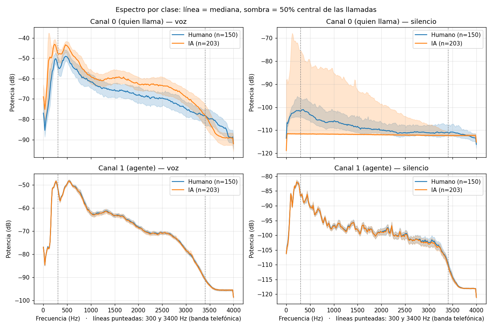

# Fase 0 — Trampas en los datos

**Pregunta:** ¿hay algo en los datos que distinga humanos de IAs **sin tener que ver con ser IA**?
Si lo hay, el modelo puede aprender ese atajo y fallar con las llamadas de Altur. Es el caso del
modelo que "reconocía lobos" porque en todas sus fotos de lobos había nieve.

**Resultado en una frase:** hay **2 trampas** (volumen y silencio digital), **2 cosas
sospechosas** que hay que preguntar a Altur, y la señal principal —cuánto tarda quien llama en
contestar— se ve **legítima**.

---

## Cómo correrlo

```bash
python fase0/trampas.py --datos ../hackmty26
```

En Colab: `!python fase0/trampas.py --datos /content/hackmty26`

- Solo usa numpy, scipy y matplotlib (vienen en Colab). Tarda unos 25 s.
- Las mediciones por llamada se guardan en `<datos>/fase0/` y **no se suben**: llevan la
  etiqueta de cada llamada.
- Al repo solo van `resultados/rasgos.csv` (medianas y AUC por clase) y `resultados/espectro.png`.
- `--rehacer` vuelve a medir aunque ya exista el caché.

## Cómo leer los números

- **AUC:** probabilidad de que una llamada de IA tenga un valor mayor que una humana.
  0.5 = azar · cerca de 1 = la IA tiene valores más altos · cerca de 0 = más bajos.
- **Veredicto:** *FUERTE* si separa al menos 0.70 (o 0.30 o menos) **en train y en val**, en la
  misma dirección; *moderada* desde 0.60; si no, *no separa*.
- Los tramos de voz y silencio salen de `turns/`, que Altur generó de forma automática. Sirven
  para explorar; el modelo final usa su propio detector de voz.

## Cómo leer la gráfica



- **Horizontal:** frecuencia, de graves (0 Hz) a agudos (4000 Hz, el máximo a 8 kHz).
- **Vertical:** energía en dB. +10 dB = 10 veces más energía.
- **Línea:** la mediana de las llamadas (la de en medio). **Sombra:** el 50 % central (entre la
  llamada del 25 % y la del 75 %). Muestra qué tan distintas son las llamadas entre sí; **no** es
  un margen de error.
- **Azul:** humanas (150) · **naranja:** IA (203) · **punteadas:** 300 y 3400 Hz, la banda
  telefónica.
- **Voz:** tramos donde habla ese canal. **Silencio:** ratos donde **nadie** habla, dejando
  0.25 s de margen alrededor de cada turno.

| Gráfica | Qué dice |
|---|---|
| Canal 0, voz | La IA suena más fuerte y con más graves |
| Canal 0, silencio | La mayoría de las IAs tienen silencio digital: línea plana, sin ruido de fondo |
| Canal 1, voz | El agente suena igual en todas las llamadas |
| Canal 1, silencio | El fondo del agente es igual en todas las llamadas |

---

## Hallazgos

**Contexto:** todas las llamadas, de ambas clases y en ambos canales, pasaron por el mismo códec
telefónico (μ-law): usan como mucho unos 256 valores distintos y su pico es 32124. Las
diferencias vienen de **cómo entró la voz** antes del códec.

### 🔴 Trampa 1 — La IA suena 7 dB más fuerte

| | Humano | IA | AUC train | AUC val |
|---|---|---|---|---|
| Volumen de la voz de quien llama | −23.3 dBFS | −16.0 dBFS | 0.80 | 0.93 |

El volumen depende de cómo se configuró la voz sintética, no de ser IA.
**Qué hacer:** normalizar con una ganancia constante por canal (Paso 3).

### 🔴 Trampa 2 — Silencio digital en la IA

Cuando nadie habla, las llamadas humanas traen ruido de línea o del cuarto, con más graves que
agudos. La mayoría de las de IA son **planas**: solo queda el mínimo del códec.

| | Humanas con silencio plano | IA con silencio plano |
|---|---|---|
| train | 20 de 113 (18 %) | 113 de 169 (67 %) |
| val | 4 de 37 (11 %) | 23 de 34 (68 %) |

La regla "silencio plano = IA" acierta **56 de 71** en val sin escuchar a nadie.
Normalizar el volumen **no** la corrige: cambia la forma del ruido, no su nivel.
**Qué hacer:** no usar rasgos del silencio, del ruido de fondo ni de "voz sobre ruido"; medir
voz solo en tramas con voz.

### 🟡 Sospechoso — La voz de IA tiene más graves y menos agudos

| | Humano | IA | AUC train | AUC val |
|---|---|---|---|---|
| % de energía de la voz bajo 300 Hz | 19 % | 36 % | 0.80 | 0.80 |
| % de energía de la voz sobre 3400 Hz | 0.07 % | 0.01 % | 0.06 | 0.13 |

En los silencios la IA tiene **menos** graves, así que no es la línea la que los agrega:
probablemente son las voces sintéticas. Si Altur usó pocas voces, el modelo aprendería "estas
voces" y no "voz de IA". A favor: val tiene otros hablantes y aun así separa.
**Qué hacer:** se puede usar, pero validando agrupado por voz.

### 🟡 Posible fuga — El agente habla menos en llamadas de IA

| | Humano | IA | AUC train | AUC val |
|---|---|---|---|---|
| % de la llamada en que habla el agente | 54 % | 46 % | 0.16 | 0.09 |

No se explica solo porque la IA tarde más en contestar: entre llamadas donde quien llama tarda
0.5–1.5 s (86 humanas y solo 12 de IA), el agente habla 54.1 % contra 45.3 % (AUC 0.13).
Puede ser una reacción real del agente o que las llamadas de IA se grabaran con otra versión o
guion del agente.
**Qué hacer:** no usar rasgos que miren solo al agente hasta que Altur responda.

### 🟢 Limpio — Cómo suena el agente

Volumen, ruido y espectro del canal 1 son iguales en ambas clases (por ejemplo, volumen de la
voz: −22.2 contra −22.3 dBFS; AUC 0.46 y 0.40). El audio del agente no delata la clase.

### 🟢 Señal legítima — Cuánto tarda quien llama en contestar

| | Humano | IA | AUC train | AUC val |
|---|---|---|---|---|
| Latencia mediana de quien llama | 0.90 s | 2.16 s | 0.86 | 0.85 |
| % de la llamada en que nadie habla | 13 % | 20 % | 0.87 | 0.84 |

No depende del volumen, del ruido ni del sonido del agente. Es el núcleo del proyecto.

---

## Qué significa para cada fase

| Fase | Regla que sale de la Fase 0 |
|---|---|
| 1. Leer llamadas | Normalizar el volumen con ganancia constante por canal. Revisar que el detector de voz se equivoque parecido en ambas clases: el silencio limpio de la IA lo vuelve más fácil |
| 2. Voz | LFCC (y CPP si entra) solo en tramas con voz. Quitar el primer coeficiente LFCC o normalizar antes, porque es casi el volumen. Nada de rasgos del silencio o del ruido |
| 3. Conversación | Usar la latencia **mediana**. Medir interrupciones por tiempos, no por energía. Sin rasgos que miren solo al agente hasta que Altur responda. **Agregado en la Fase 1:** las llamadas humanas traen eco del agente en el canal 0; latencias y encimadas solo con los tramos del detector, nunca con energía del canal 0 mientras habla el agente (ver `fase1/README.md`) |
| 4. Modelo | Agregar rasgos uno a la vez y quedarse con los que suben el marcador en `val`. Validar agrupando por voz |
| 5. API | La misma normalización y el mismo detector de voz que en el entrenamiento |

## Preguntas para Altur

1. ¿Las llamadas de IA se inyectaron como audio digital sin ruido de fondo? ¿Las llamadas con
   que evalúan también son así?
2. ¿Las llamadas humanas y las de IA usaron la misma versión y el mismo guion del agente?

## Límites de este análisis

- Los tramos de voz vienen de `turns/`, generados automáticamente.
- Cada rasgo se evaluó solo; combinados pueden separar más o menos.
- El control del agente por latencia tiene solo 12 llamadas de IA en el grupo de 0.5–1.5 s.
- No sabemos cuántas voces sintéticas distintas hay en el dataset.
